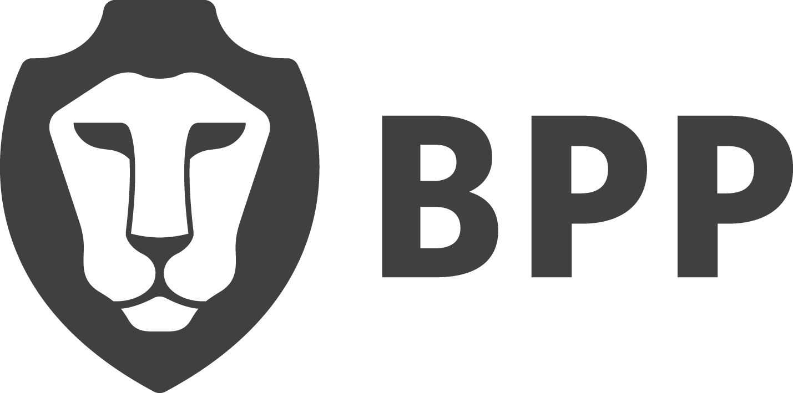
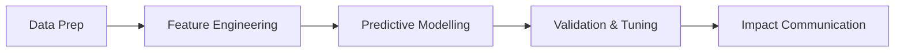

<div align="center">
  
  <h1>M9 Machine Learning Module</h1>
  <p><strong>BSc (Hons) Data Science Integrated Degree Apprenticeship (Level 6)</strong></p>
  
  <p>
    <a href="https://bpp-sot.github.io/l6ds-m9-machine-learning/"></a>
    <a href="https://www.bpp.com/"></a>
  </p>
</div>

<br />

Welcome to the central repository and documentation hub for the **M9 Machine Learning** module. 

This microsite has been specifically crafted for data science apprentices (Level 6), focusing on the practical application of machine learning techniques using Python, Pandas, and Scikit-Learn within modern workplace environments. 

## 🎯 Course Overview

This module covers the end-to-end framework of an applied machine learning lifecycle. Embedded through the [Diátaxis](https://diataxis.fr/) methodology, learners are guided via explicit Tutorials, contextual How-To Guides, theoretical Explanations, and actionable Reference Materials. 



### Core Topics
1. Data Preparation & Preprocessing
2. Feature Engineering & Selection
3. Predictive Modelling (Supervised)
4. Non-Parametric Modelling
5. Clustering & Unsupervised Learning 
6. Time Series Analysis & Forecasting
7. Model Validation & Hyperparameter Tuning
8. Application, Communication & Impact

## 🚀 Live Environment

The interactive course materials, visualisations, and codebase integration documentation are published directly via Github Pages:

👉 **[Access the ML Microsite Here](https://bpp-sot.github.io/l6ds-m9-machine-learning/)**

---

## 🛠 For Contributors and Educators

This site is built using **MkDocs Material** with customized BPP University styling and LaTeX integrations. 

### Local Development Setup

To test and develop the pages locally before pushing to the `main` branch, ensure you have Python installed and run the following commands:

```bash
# Clone the repository
git clone https://github.com/bpp-sot/l6ds-m9-machine-learning.git
cd l6ds-m9-machine-learning

# Create and activate a virtual environment
python -m venv venv
source venv/bin/activate # On Windows: .\venv\Scripts\activate

# Install the necessary dependencies
pip install mkdocs-material

# Serve the site locally
mkdocs serve
```

Preview the documentation securely at `http://127.0.0.1:8000`.

### Building for Deployment

We enforce strict compilation to prevent broken links or markdown artifacting. Before you push any new module content, run:

```bash
mkdocs build --strict
```

*This requires 0 warnings to pass.*

## 📋 Standard Mappings

Content and practical assessments rigorously map back to the **L6 Data Science Apprenticeship Standard**, emphasizing:
- `K1/K2`: Statistical concepts and ML algorithms
- `S4/S7`: Importing, cleansing, and generating actionable insights
- `B1/B2`: Logical workflow and technical communication

<div align="center">
  <i>&copy; 2026 BPP University School of Technology</i>
</div>
