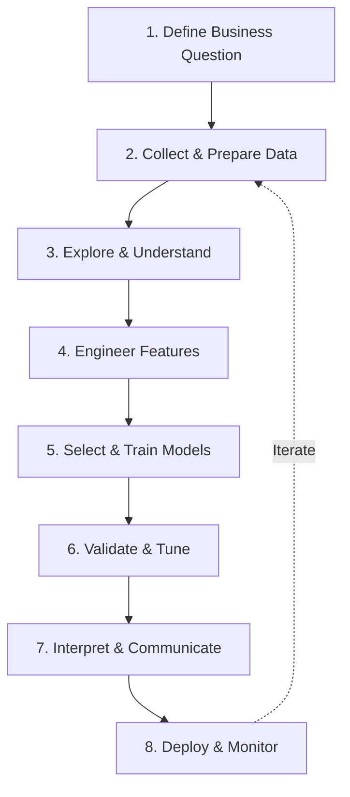

# ML Workflow Overview

## The End-to-End Pipeline

## Mapping to Assessment

| Pipeline Stage | Assessment Section | Key Deliverable |
|---------------|-------------------|-----------------|
| Business Question | Background | Problem statement with hypothesis |
| Data Preparation | Section A | Documented preprocessing steps |
| Feature Engineering | Section A | Justified feature choices |
| Model Selection | Section A | Comparison of 2+ approaches |
| Validation | Section B | Metrics with confidence intervals |
| Communication | Section C | Business impact and recommendations |

## Key Principles

**Iterative, not linear** — you will revisit earlier stages as you learn more about your data.

**Start with the business question** — every technical decision should trace back to the problem you are solving.

**Compare at least two approaches** — the assessment requires comparison. Never present a single model without alternatives.

**Document your decisions** — the *why* matters as much as the *what*. Record why you chose specific preprocessing steps, features, and algorithms.

!!! info "Assessment Requirement"
    Your presentation must demonstrate an end-to-end ML workflow from data preparation through to business impact. This site is structured to guide you through each stage.
