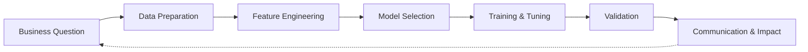

# Machine Learning

Welcome to the **M9 Machine Learning** module microsite for the BSc (Hons) Data Science programme at BPP University School of Technology.

## About This Site

This site follows the [Diátaxis framework](https://diataxis.fr/) for technical documentation, organising content into four types:

| Type | Purpose | When to Use |
|------|---------|-------------|
| **Tutorials** | Learning-oriented step-by-step exercises | When learning a new technique |
| **How-to Guides** | Task-oriented solutions to specific problems | When solving a workplace problem |
| **Reference** | Information-oriented lookup tables and API docs | When you need exact parameters or syntax |
| **Explanation** | Understanding-oriented conceptual discussions | When you need to understand *why* |

## The ML Pipeline

## Topics Overview

| # | Topic | Assessment Section |
|---|-------|--------------------|
| 1 | [Data Preparation](topic-1-data-preparation/index.md) | Section A — Methodology |
| 2 | [Feature Engineering](topic-2-feature-engineering/index.md) | Section A — Methodology |
| 3 | [Predictive Modelling](topic-3-predictive-modelling/index.md) | Section A — Methodology |
| 4 | [Non-Parametric Modelling](topic-4-nonparametric-modelling/index.md) | Section A — Methodology |
| 5 | [Clustering](topic-5-clustering/index.md) | Section A — Methodology |
| 6 | [Time Series](topic-6-time-series/index.md) | Section A — Methodology |
| 7 | [Validation & Tuning](topic-7-validation-tuning/index.md) | Section B — Results |
| 8 | [Communication & Impact](topic-8-communication-impact/index.md) | Section C — Impact |

## Getting Started

New to machine learning? Start with [Environment Setup](getting-started/setup.md), then work through the topics in order.

!!! tip "Apprenticeship Context"
    Throughout this site, examples use real-world business scenarios relevant to your workplace. Concepts are connected to the Knowledge, Skills, and Behaviours (KSBs) in the L6 Data Science Apprenticeship Standard.

## Interactive Learning

All code examples are designed to run in **Jupyter Notebooks** or **Google Colab**. Each tutorial includes complete, runnable Python code using scikit-learn, pandas, and other standard libraries.

## Contributing

Found an error or have a suggestion? Please [open an issue](https://github.com/YOUR-GITHUB-USERNAME/machine-learning/issues) on GitHub.
