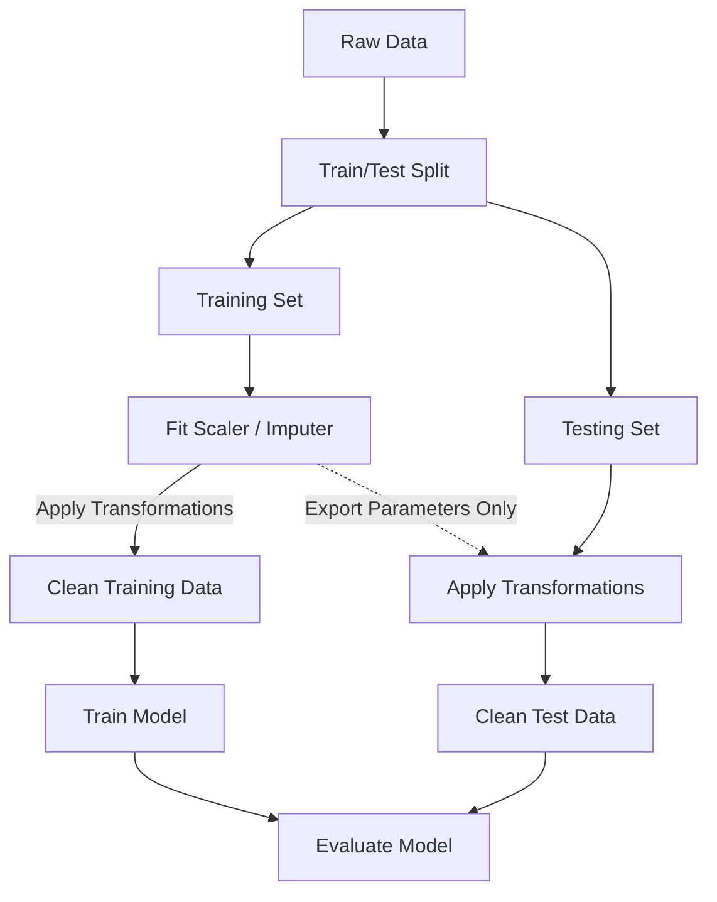

# Explanation: Understanding Data Leakage

## Conceptual Overview
**Data Leakage** (or target leakage) occurs when information from outside the training dataset is used to create the model. This additional information allows the model to learn or know something that it otherwise would not know when actively deployed in production. 

It creates a model that performs suspiciously well on training metrics (e.g. 99% accuracy) but completely collapses when analyzing novel information.

## The Flow of Time Breakage

Data leakage creates a localized time paradox within your machine learning framework. 

When you deploy a model in the real world to predict an event (e.g., "Will this patient have a heart attack next week?"), it only has access to current parameters. However, if your training dataset includes a variable like `administered_cpr = True`, the model will leverage this to perfectly predict a heart attack. 

In production, you will never know `administered_cpr` *before* the heart attack occurs. The model has "leaked" future information.

## How Leakage Happens in Preprocessing

The most common, silent form of data leakage happens during **Imputation and Scaling**.

### The Wrong Way (Leaky)
```python
import pandas as pd
from sklearn.preprocessing import StandardScaler
from sklearn.model_selection import train_test_split

X = pd.DataFrame({'Age': [25, 30, 35, 40, 45, 80, 85]})

# ALARM: Scaling BEFORE splitting!
scaler = StandardScaler()
X_scaled = scaler.fit_transform(X) 

X_train, X_test = train_test_split(X_scaled, test_size=0.2, random_state=42)
```
In this scenario, the `StandardScaler` calculated the `Mean` and `Variance` of the **entire** dataset, meaning information about the outliers (80, 85) in the test set leaked algebraically into the scaling parameters applied to the training set.

### The Correct Way (Isolated)
```python
# Split FIRST
X_train, X_test = train_test_split(X, test_size=0.2, random_state=42)

scaler = StandardScaler()
# Fit ONLY on the training data
X_train_scaled = scaler.fit_transform(X_train)

# Transform the test data using the training parameters
X_test_scaled = scaler.transform(X_test)
```

## Workflow Protection



## Connection to Practice
Using `sklearn.pipeline.Pipeline` natively constructs the "Correct Way" architecture, ensuring data isolation. Demonstrating this architectural safety measure within your apprenticeship presentation highlights advanced technical comprehension compared to novices who write sequential blocks of independent pandas aggregations.
