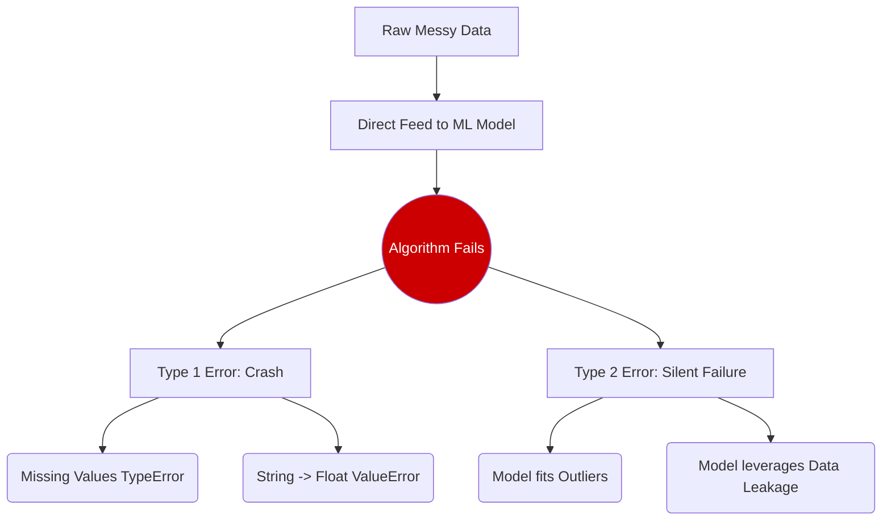

# Explanation: Why Data Preparation Matters

## Conceptual Overview
It is mathematically impossible for an algorithm to infer contextual logic from broken, raw telemetry. If a machine learning pipeline is thought of as a manufacturing plant, the algorithm itself is merely the final assembly robot. **Data Preparation** represents the entire supply chain sorting, filtering, and mining the raw refined materials before they reach the assembly floor. 

Feeding raw, messy data into an advanced algorithm (like XGBoost or a Neural Network) results in a phenomenon called "Garbage In, Garbage Out".

## Real-world Workplace Analogy
Imagine assigning a junior analyst to calculate average company sales for Q3. If you simply dump 50,000 unformatted receipts onto their desk—some in Euros, some in Dollars, some missing dates, and some duplicated—the analyst will calculate an incorrect number. 

A machine learning model has the exact same limitation. It cannot "guess" what an empty cell means unless you formulate a mathematical rule (imputation) to handle it.

## The Mathematical Rationale

Many algorithms rely fundamentally on geometry and distance. Consider the $K$-Nearest Neighbors algorithm identifying similarities between two employees. The distance formula $d(p, q)$ between two points $p$ and $q$ in an $n$-dimensional Euclidean space is:

\\[
d(p, q) = \\sqrt{\\sum_{i=1}^{n} (q_i - p_i)^2}
\\]

If employee $A$ has an age of `35` and a salary of `$90,000`, and employee $B$ has an age of `40` and a salary of `$91,000`, the algorithm computes:
\\[
\\sqrt{(40-35)^2 + (91000-90000)^2} = \\sqrt{25 + 1000000} \\approx 1000
\\]

The "Salary" feature entirely dominates the calculation simply because its scale is massive compared to "Age". The algorithm will functionally ignore Age. Data Preparation (specifically, Scaling) corrects this structural imbalance.

## The Cost of Skipping Preparation

### 1. Functional Crashes (Type 1 Errors)
Libraries like `scikit-learn` are strictly typed. If you pass a Pandas DataFrame containing `np.nan` values into a `LinearRegression` model, Python will immediately throw a `ValueError`. 

### 2. Silent Failures (Type 2 Errors)
Often much more dangerous in a workplace environment are silent failures. If you feed an unscaled dataset into an algorithm, the model will compile perfectly and return predictions. However, those predictions will be structurally biased and conceptually flawed.

## Connection to Practice
During your L6 assessment, a massive portion of the grading rubric stems from your ability to justify the *transformational logic* of your data. The examiners want to see that you comprehend the shape and structure of the telemetry before you deploy the algorithm.
