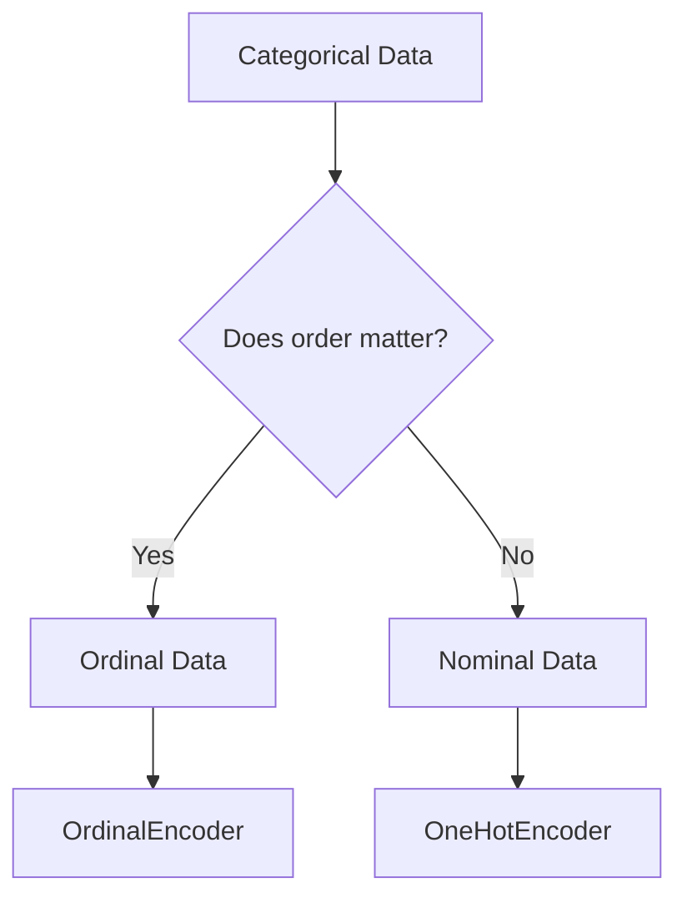

# Data Types & Encoding

> "Algorithms don't understand 'Red', 'Green', or 'Blue'. They only understand 0, 1, and 2."

## What You Will Learn

- Distinguish between Ordinal and Nominal categorical data
- Implement One-Hot Encoding and get around the Dummy Variable Trap
- Utilize Target Encoding for high-cardinality features
- Construct a robust categorical preprocessing pipeline

## Prerequisites

- [Handling Missing Values](missing-values.md)

## Step 1: Nominal vs. Ordinal Data

Before encoding, classify your text columns:
- **Nominal**: Categories with no inherent order (e.g., City, Color).
- **Ordinal**: Categories with a logical sequence (e.g., Low, Medium, High).



## Step 2: One-Hot Encoding (Nominal)

One-Hot Encoding converts each category into a new binary column.

```python
import pandas as pd
from sklearn.preprocessing import OneHotEncoder

data = pd.DataFrame({
    'City': ['London', 'Manchester', 'London', 'Birmingham'],
    'Salary': [55000, 48000, 62000, 42000]
})

# drop='first' helps avoid perfect multicollinearity (the Dummy Variable Trap)
encoder = OneHotEncoder(sparse_output=False, drop='first')
encoded_cities = encoder.fit_transform(data[['City']])

# Recombine into a DataFrame
encoded_df = pd.DataFrame(
    encoded_cities, 
    columns=encoder.get_feature_names_out(['City'])
)
final_df = pd.concat([data['Salary'], encoded_df], axis=1)
print(final_df)
```

!!! note "Assessment Connection"
    If you apply linear models (like Linear Regression or Logistic Regression), you *must* justify your use of `drop='first'`. Tree-based models (Random Forest, XGBoost) generally do not suffer from the dummy variable trap.

## Step 3: Ordinal Encoding

For sizes like "Small", "Medium", "Large", we map them to integers.

```python
from sklearn.preprocessing import OrdinalEncoder

sizes = pd.DataFrame({'Size': ['Small', 'Large', 'Medium', 'Small']})

# Explicitly define the order
ordering = [['Small', 'Medium', 'Large']]
ord_encoder = OrdinalEncoder(categories=ordering)

sizes['Size_Encoded'] = ord_encoder.fit_transform(sizes[['Size']])
print(sizes)
```

## Step 4: Target Encoding

When dealing with high-cardinality features (e.g., Postcodes), One-Hot encoding will explode your feature space. Target Encoding replaces categories with the average target value for that category.

```python
from sklearn.preprocessing import TargetEncoder
import numpy as np

# Sample data
X = np.array([["A"], ["A"], ["B"], ["B"], ["C"]])
y = np.array([1, 0, 1, 1, 0])

# Smooth helps prevent overfitting on rare categories
te = TargetEncoder(smooth="auto")
X_encoded = te.fit_transform(X, y)
print(X_encoded)
```

## Summary

Proper encoding ensures algorithms can mathematically process the data without introducing false relationships (e.g., assuming category '3' is intrinsically "better" than category '1' just because it's a higher number).

## Next Steps

→ [Scaling & Normalisation](scaling-normalisation.md)

## KSB Mapping

| KSB | Description | How This Tutorial Addresses It |
|-----|-------------|-------------------------------|
| S4 | Import, cleanse, transform data | Converting strings into algorithm-ready numbers |
| K6 | Data analytics | Understanding the statistical implications of encoding |
