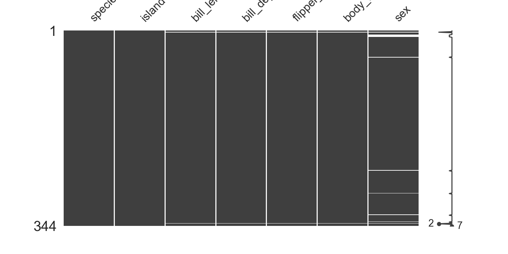
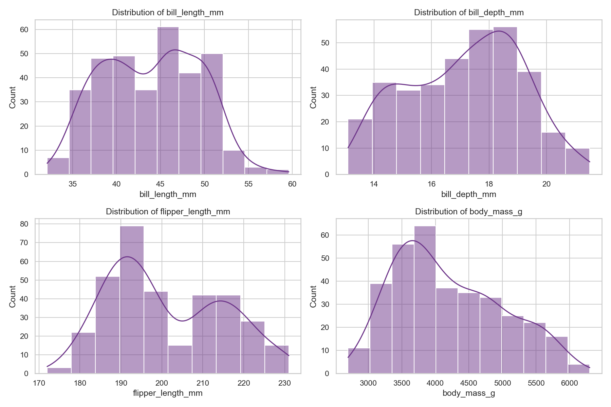
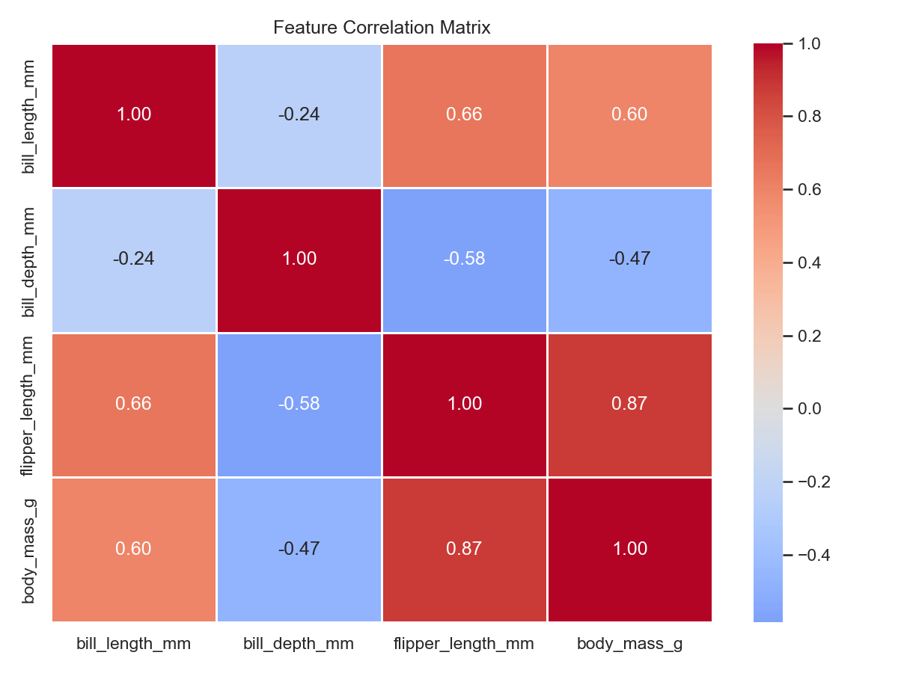

# Loading & Exploring Data

> The first step in any ML project is understanding what you're working with. 

## What You Will Learn
- Load data securely using pandas and built-in datasets
- Inspect dataset shape, types, and basic statistics efficiently
- Identify missing values and duplicates with minimal code
- Create initial visualisations to understand distributions and relationships

## Prerequisites
- Python environment set up
- Basic familiarity with `pandas` and `seaborn`

## Step 1: Load Your Data

Instead of manually loading CSVs, we will use the built-in `penguins` dataset from Seaborn. This dataset contains physical measurements of three penguin species and is excellent for demonstrating data preparation.

```python
import pandas as pd
import numpy as np
import seaborn as sns
import matplotlib.pyplot as plt
import missingno as msno

# Load the built-in penguins dataset
df = sns.load_dataset('penguins')

print(f"Dataset shape: {df.shape}")
df.head(3)
```

??? example "Expected Output"
    ```text
    Dataset shape: (344, 7)
    ```
    
    | | species | island | bill_length_mm | bill_depth_mm | flipper_length_mm | body_mass_g | sex |
    |---|---------|--------|----------------|---------------|-------------------|-------------|-----|
    | 0 | Adelie | Torgersen | 39.1 | 18.7 | 181.0 | 3750.0 | Male |
    | 1 | Adelie | Torgersen | 39.5 | 17.4 | 186.0 | 3800.0 | Female |
    | 2 | Adelie | Torgersen | 40.3 | 18.0 | 195.0 | 3250.0 | Female |

!!! tip "Workplace Tip"
    In your workplace project, document exactly where your data comes from. The assessment rubric values transparency about data sources and any SQL transformations applied before your Python analysis string.

## Step 2: First Look at the Data

Use pandas built-in methods to concisely summarise the numeric and categorical columns.

```python
# Summary statistics for numeric columns
df.describe().round(2)
```

??? example "Expected Output"
    | | bill_length_mm | bill_depth_mm | flipper_length_mm | body_mass_g |
    |---|---|---|---|---|
    | count | 342.00 | 342.00 | 342.00 | 342.00 |
    | mean | 43.92 | 17.15 | 200.92 | 4201.75 |
    | std | 5.46 | 1.97 | 14.06 | 801.95 |
    | min | 32.10 | 13.10 | 172.00 | 2700.00 |
    | 25% | 39.23 | 15.60 | 190.00 | 3550.00 |
    | 50% | 44.45 | 17.30 | 197.00 | 4050.00 |
    | 75% | 48.50 | 18.70 | 213.00 | 4750.00 |
    | max | 59.60 | 21.50 | 231.00 | 6300.00 |

!!! info "Assessment Connection"
    Section A of your presentation should demonstrate that you thoroughly understood your data before modelling. Examiners want to see evidence of systematic exploration, not just jumping straight to algorithms.

## Step 3: Missing Values Audit

Rather than looping over columns, use pandas method chaining to generate a clean summary of missing data.

```python
# Create a concise missing values summary
missing_summary = df.isnull().sum().sort_values(ascending=False)
print(missing_summary[missing_summary > 0])
```

??? example "Expected Output"
    ```text
    sex                  11
    bill_length_mm        2
    bill_depth_mm         2
    flipper_length_mm     2
    body_mass_g           2
    dtype: int64
    ```

For a visual representation of missing data, the `missingno` library is the industry standard:

```python
# Matrix view — shows patterns of missingness
msno.matrix(df, figsize=(10, 5))
plt.title('Penguins Dataset: Missing Value Patterns', fontsize=16)
plt.tight_layout()
plt.show()
```

??? example "Expected Plot"
    

## Step 4: Distribution Analysis

Use Seaborn to quickly visualise the distributions of your numeric variables. It handles NaN values natively and requires far less code than Matplotlib.

```python
# Plot numeric distributions
numeric_cols = df.select_dtypes(include=[np.number]).columns
fig, axes = plt.subplots(nrows=2, ncols=2, figsize=(12, 8))
axes = axes.flatten()

for i, col in enumerate(numeric_cols):
    sns.histplot(data=df, x=col, kde=True, ax=axes[i], color='#6E368A')
    axes[i].set_title(f'Distribution of {col}')

plt.tight_layout()
plt.show()
```

??? example "Expected Plot"
    

## Step 5: Correlation Analysis

Identify highly correlated features immediately to diagnose multicollinearity before modelling.

```python
# Correlation matrix
plt.figure(figsize=(8, 6))
corr_matrix = df.select_dtypes(include=[np.number]).corr()
sns.heatmap(corr_matrix, annot=True, fmt='.2f', cmap='coolwarm', center=0, linewidths=0.5)
plt.title('Feature Correlation Matrix')
plt.tight_layout()
plt.show()
```

??? example "Expected Plot"
    

## Summary
- Use `sns.load_dataset` for instant access to practice data
- Use `df.describe()` and `df.info()` for immediate statistical summaries
- Use method chaining (`df.isnull().sum().sort_values(ascending=False)`) for concise reporting
- Use `missingno` to visually identify patterns in your missing data
- Use `seaborn` heatmaps and histplots for heavily reduced plotting code

## Next Steps
→ [Handling Missing Values](missing-values.md) — decide how to treat the missing data you've identified

??? challenge "Stretch & Challenge"
    ### For Advanced Learners
    
    **Try automated EDA profiling**
    
    Instead of writing the exploration steps manually, try using `ydata_profiling` to generate a comprehensive HTML report of your dataset in just three lines of code:
    
    ```python
    from ydata_profiling import ProfileReport
    
    # Generate the report
    profile = ProfileReport(df, title="Penguins Profiling Report")
    
    # Save to a file to open in your browser
    profile.to_file("penguins_report.html")
    ```
    
    In your EPA presentation, doing this can save you 30 minutes of manual plotting while revealing deeper correlations and interactions you may have missed!

## KSB Mapping

| KSB | Description | How This Addresses It |
|-----|-------------|-------------------------------|
| K5.3 | Common patterns in real-world data | Identifying missing values, duplicates, outliers, and class imbalance |
| S2 | Data engineering and governance | Systematic data cleaning, transformation, and quality assessment |
| S3 | Programming for data manipulation | pandas pipelines for data preparation |
| B3 | Adaptability and pragmatism | Handling imperfect real-world datasets |
