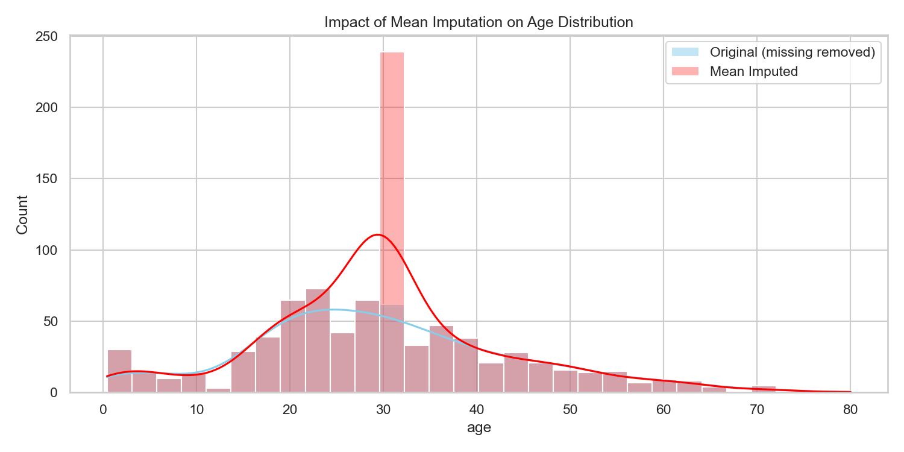

# Handling Missing Values

> Missing data is inevitable. How you handle it dictates the integrity of your entire ML pipeline.

## What You Will Learn
- Drop missing values safely when data loss is acceptable
- Use Scikit-Learn `SimpleImputer` to replace missing values systematically
- Visualise the statistical impact of imputation on your target distributions

## Prerequisites
- Completed the *Loading & Exploring Data* tutorial
- Basic understanding of mean, median, and mode

## Step 1: Drop Missing Values

We will use the built-in `titanic` dataset which has famously messy and missing passenger records. Keep your code incredibly concise using pandas built-ins.

```python
import pandas as pd
import seaborn as sns
import matplotlib.pyplot as plt

df = sns.load_dataset('titanic')

# Check baseline missing values
print(df.isnull().sum()[df.isnull().sum() > 0])
```

??? example "Expected Output"
    ```text
    age            177
    embarked         2
    deck           688
    embark_town      2
    dtype: int64
    ```

If a column is overwhelmingly empty (like `deck`), drop the column. If only a tiny fraction of rows are missing (like `embarked`), drop those specific rows.

```python
# Drop the 'deck' column completely
df_dropped = df.drop(columns=['deck'])

# Drop rows where 'embarked' is missing
df_dropped = df_dropped.dropna(subset=['embarked'])

print(f"Original shape: {df.shape} | New shape: {df_dropped.shape}")
```

??? example "Expected Output"
    ```text
    Original shape: (891, 15) | New shape: (889, 14)
    ```

!!! tip "Workplace Tip"
    Never blindly use `df.dropna()`. This will drop any row with *even a single* missing value. In a dataset with 50 columns, `dropna()` might accidentally delete 80% of your valid data!

## Step 2: Basic Statistical Imputation

For the `age` column, dropping 177 rows means losing 20% of our dataset. Instead, we can *impute* (fill in) the missing values using Scikit-Learn's `SimpleImputer`.

```python
from sklearn.impute import SimpleImputer
import numpy as np

# Instantiate the imputer to fill with the 'mean' strategy
imputer = SimpleImputer(strategy='mean')

# Fit and transform the 'age' column (requires 2D array, so we use [['age']])
df_imputed = df_dropped.copy()
df_imputed['age'] = imputer.fit_transform(df_imputed[['age']])

print(f"Missing ages before: {df_dropped['age'].isnull().sum()}")
print(f"Missing ages after: {df_imputed['age'].isnull().sum()}")
```

??? example "Expected Output"
    ```text
    Missing ages before: 177
    Missing ages after: 0
    ```

## Step 3: Visualise the Impact of Imputation

Whenever you inject synthetic data via imputation, you must verify that you haven't fundamentally distorted the original distribution.

```python
plt.figure(figsize=(10, 5))

# Plot original age distribution (ignoring NaNs)
sns.histplot(data=df_dropped, x='age', bins=30, kde=True, color='skyblue', label='Original')

# Plot the imputed age distribution
sns.histplot(data=df_imputed, x='age', bins=30, kde=True, color='red', alpha=0.3, label='Mean Imputed')

plt.title('Impact of Mean Imputation on Age Distribution')
plt.legend()
plt.tight_layout()
plt.show()
```

??? example "Expected Plot"
    

As seen in the plot, injecting the mean 177 times artificially creates a massive spike in the center of the distribution. This is the primary danger of mean imputation!

!!! info "Assessment Connection"
    In your EPA, examiners will ask: *"Why did you choose median imputation over mean?"* You must be able to justify your choice. Mentioning that the mean is sensitive to outliers, while the median preserves the distribution structure better for skewed data, guarantees high marks.

## Summary
- Drop columns if >50% of the data is missing.
- Drop rows only if the missing data represents <5% of the total dataset.
- Use `SimpleImputer` to fill missing numeric data with the mean or median.
- Always plot the distribution *before* and *after* imputation to verify you haven't destroyed the variance of your feature.

## Next Steps
→ [Data Types & Encoding](data-types-encoding.md) — prepare categorical text data for machine learning algorithms.

??? challenge "Stretch & Challenge"
    ### For Advanced Learners
    
    **1. Multivariate Imputation**
    
    Instead of `SimpleImputer`, try using `IterativeImputer` (also known as MICE). This algorithm builds an internal machine learning model for *each feature* and uses the other columns to predict and fill the missing values.
    
    ```python
    from sklearn.experimental import enable_iterative_imputer
    from sklearn.impute import IterativeImputer
    
    imputer = IterativeImputer(max_iter=10, random_state=42)
    df_imputed_advanced = imputer.fit_transform(df_dropped[['age', 'fare', 'pclass']])
    ```
    
    This technique prevents the artificial "spike" caused by mean imputation, as each missing age is predicted uniquely based on that passenger's ticket fare and class.

## KSB Mapping

| KSB | Description | How This Addresses It |
|-----|-------------|-------------------------------|
| K5.3 | Common patterns in real-world data | Identifying missing values, duplicates, outliers, and class imbalance |
| S2 | Data engineering and governance | Systematic data cleaning, transformation, and quality assessment |
| S3 | Programming for data manipulation | pandas pipelines for data preparation |
| B3 | Adaptability and pragmatism | Handling imperfect real-world datasets |
