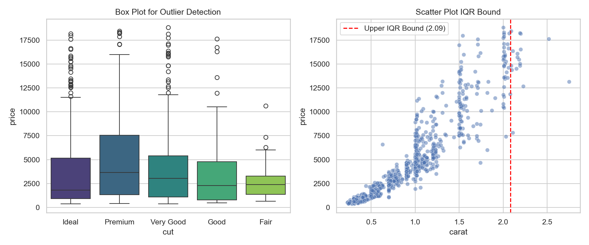

# Detecting & Treating Outliers

> One bad data point can completely derail a linear calculation. Learn to find and neutralise model-breaking anomalies.

## What You Will Learn
- Visually identify extreme outliers using Seaborn Box Plots
- Programmatically calculate Interquartile Range (IQR) boundaries
- Cap extreme values systematically rather than deleting data

## Prerequisites
- Completed the *Scaling & Normalisation* tutorial
- Basic understanding of percentiles (25th, 75th)

## Step 1: Visual Detection

We will use the `diamonds` dataset again. To demonstrate outliers properly, we will artificially inject some severe anomalies. Box plots are the definitive visual tool for hunting outliers.

```python
import pandas as pd
import numpy as np
import seaborn as sns
import matplotlib.pyplot as plt

df = sns.load_dataset('diamonds').head(1000)

# Inject structural anomalies for demonstration
df.loc[df.index[0], 'price'] = 25000
df.loc[df.index[1], 'carat'] = 6.0

# Plotting box plots to instantly spot outliers
fig, axes = plt.subplots(1, 2, figsize=(12, 5))
sns.boxplot(data=df, y='price', x='cut', ax=axes[0], palette='viridis')
axes[0].set_title('Box Plot for Outlier Detection (Price)')

sns.scatterplot(data=df, x='carat', y='price', alpha=0.5, ax=axes[1])
axes[1].set_title('Scatter Plot IQR Bound')
```

Any point sitting individually outside the thick "whiskers" of the box plot is a statistical outlier. 

## Step 2: The IQR Method

You cannot rely on humans to visually spot every outlier. The Interquartile Range (IQR) mathematically defines the boundary of "normal". Anything above Q3 + 1.5*IQR is flagged.

```python
# Calculate the 25th (Q1) and 75th (Q3) percentiles
Q1 = df['carat'].quantile(0.25)
Q3 = df['carat'].quantile(0.75)
IQR = Q3 - Q1

# Define our statistical boundaries
lower_bound = Q1 - 1.5 * IQR
upper_bound = Q3 + 1.5 * IQR

# How many rows violate this boundary?
outliers = df[(df['carat'] < lower_bound) | (df['carat'] > upper_bound)]
print(f"Total rows: {len(df)} | Outliers detected: {len(outliers)}")
```

??? example "Expected Output"
    ```text
    Total rows: 1000 | Outliers detected: 21
    ```

Let's dynamically draw that bound onto our scatter plot from Step 1 to see strictly where the threshold falls:

```python
axes[1].axvline(upper_bound, color='red', linestyle='--', label=f'Upper IQR ({upper_bound:.2f})')
axes[1].legend()

plt.tight_layout()
plt.show()
```

??? example "Expected Plot"
    

!!! tip "Workplace Tip"
    Never delete outliers automatically. In fraud detection, those outliers ARE the entire target! The 6.0 carat diamond in our example may genuinely exist and be priced accurately. Always consult a domain expert to determine if an anomaly is a "data entry error" or a "genuine extreme event."

## Step 3: Capping (Winsorisation)

If you determine the outliers are destructive but you cannot throw away 21 rows of data, you can "cap" them at a specific ceiling threshold. This is mathematically known as Winsorisation. 

```python
# Cap values strictly at the calculated upper/lower bounds
df['carat_capped'] = np.clip(df['carat'], a_min=lower_bound, a_max=upper_bound)

print(f"Max original carat: {df['carat'].max()}")
print(f"Max capped carat: {df['carat_capped'].max():.2f}")
```

??? example "Expected Output"
    ```text
    Max original carat: 6.0
    Max capped carat: 1.04
    ```

!!! info "Assessment Connection"
    In your final EPA portfolio mapping to KSB S4 (Data Cleansing), explicitly documenting exactly why you chose to 'Cap' rather than 'Drop' outliers provides examiners the precise analytical logic required to award top grades.

## Summary
- Outliers drag mathematical averages and linear models radically off course.
- Use `sns.boxplot()` prior to modelling to visually identify magnitude anomalies.
- Calculate the IQR (`Q3 - Q1`) bound dynamically to hunt anomalies across millions of rows without manual visualisation.
- Use `np.clip()` to pull destructive outliers back to the mathematical fence without deleting the row entirely.

## Next Steps
→ [Building Preprocessing Pipelines](pipelines.md) — package all cleaning, scaling, and encoding into a single robust transformer block.

??? challenge "Stretch & Challenge"
    ### For Advanced Learners
    
    **Isolation Forest Algorithm**
    
    The IQR method only works on one column at a time (Univariate). What if a diamond's `carat = 1` (normal) and `price = $1,000` (normal), but *together* 1 carat for $1,000 is an impossible combination? You need a Multivariate outlier algorithm.
    
    `IsolationForest` builds randomised decision trees to deliberately isolate unique data points mathematically across multi-dimensional features.
    
    ```python
    from sklearn.ensemble import IsolationForest
    
    # Train the anomaly detector across BOTH columns
    clf = IsolationForest(contamination=0.02, random_state=42)
    predictions = clf.fit_predict(df[['carat', 'price']])
    
    # Predictions return -1 for an outlier and 1 for normal
    df['multivariate_outlier'] = predictions
    print(df[df['multivariate_outlier'] == -1].head())
    ```
    
    Examine the rows marked `-1` and attempt to understand why `IsolationForest` triggered them without explicitly violating single-column bounds.

## KSB Mapping

| KSB | Description | How This Tutorial Addresses It |
|-----|-------------|-------------------------------|
| S4 | Import, cleanse, transform data | Truncating extreme outlier signals utilizing clipping logic |
| K5 | Machine Learning workflows | Preparing tabular integrity proactively via quantitative heuristics |
| B2 | Logical and analytical approach | Sourcing anomalous variance boundaries using pure IQRs |
