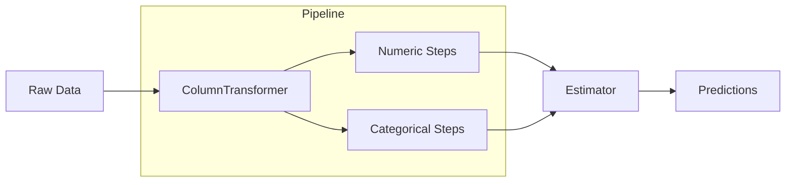

# Building Preprocessing Pipelines

> "A machine learning model without a structured pipeline is just an academic experiment destined to fail in production."

## What You Will Learn

- Create automated transformation blocks via `Pipeline`
- Combine disparate transformation types (categorical, numeric) using `ColumnTransformer`
- Protect models from data leakage during cross-validation

## Prerequisites

- [Scaling & Normalisation](scaling-normalisation.md)
- [Data Types & Encoding](data-types-encoding.md)
- [Handling Missing Values](missing-values.md)

## Step 1: Why Use Pipelines?

A `Pipeline` forces your preprocessing logic and your estimator to execute sequentially. This is crucial:
1. It creates reproducible, readable code
2. It permanently stops **Data Leakage** (when information from your Test set bleeds into your Training parameters, like the Mean for Imputation).



## Step 2: Setting up `ColumnTransformer`

Real datasets are a mix of strings, integers, and floats. We must treat them independently.

```python
import pandas as pd
from sklearn.model_selection import train_test_split
from sklearn.pipeline import Pipeline
from sklearn.compose import ColumnTransformer
from sklearn.impute import SimpleImputer
from sklearn.preprocessing import StandardScaler, OneHotEncoder
from sklearn.ensemble import RandomForestRegressor

# Synthetic dataset
df = pd.DataFrame({
    'Age': [25, np.nan, 34, 45, 23],
    'Salary': [50k, 60k, 120k, np.nan, 45k],
    'City': ['London', 'York', 'London', 'Leeds', np.nan]
})

numeric_features = ['Age', 'Salary']
categorical_features = ['City']

# Define the numeric sequence
numeric_transformer = Pipeline(steps=[
    ('imputer', SimpleImputer(strategy='median')),
    ('scaler', StandardScaler())
])

# Define the categorical sequence
categorical_transformer = Pipeline(steps=[
    ('imputer', SimpleImputer(strategy='constant', fill_value='missing')),
    ('onehot', OneHotEncoder(handle_unknown='ignore', sparse_output=False))
])

# Combine them using ColumnTransformer
preprocessor = ColumnTransformer(
    transformers=[
        ('num', numeric_transformer, numeric_features),
        ('cat', categorical_transformer, categorical_features)
    ])
```

## Step 3: Integrating the Estimator

Finally, we map the entire preprocessing block directly into an algorithm.

```python
# Create the full modeling pipeline
clf = Pipeline(steps=[('preprocessor', preprocessor),
                      ('regressor', RandomForestRegressor(random_state=42))])

# Train-Test Split
X = df.drop('Target', axis=1) # Assume Target column exists
y = df['Target']
X_train, X_test, y_train, y_test = train_test_split(X, y, test_size=0.2)

# Fit the entire sequence with ONE line of code
clf.fit(X_train, y_train)

# The test set is completely isolated and transformed exactly as the training set was
predictions = clf.predict(X_test)
```

!!! success "Assessment Checklist"
    Using `sklearn.pipeline.Pipeline` in your final apprenticeship model submission strongly demonstrates structural engineering logic. Code chunks with dozens of isolated `.fit_transform()` calls are difficult for reviewers to trace.

## Summary

Scikit-Learn's Pipeline functionality is the industry standard for bridging messy preprocessing logic seamlessly into an MLOps-ready model.

## Next Steps

Explore the Application Guides to see how we clean completely broken datasets manually.

## KSB Mapping

| KSB | Description | How This Tutorial Addresses It |
|-----|-------------|-------------------------------|
| S4 | Transform data | Implements ColumnTransformer for dual handling |
| B2 | Logical approach | Creates highly structured architecture |
