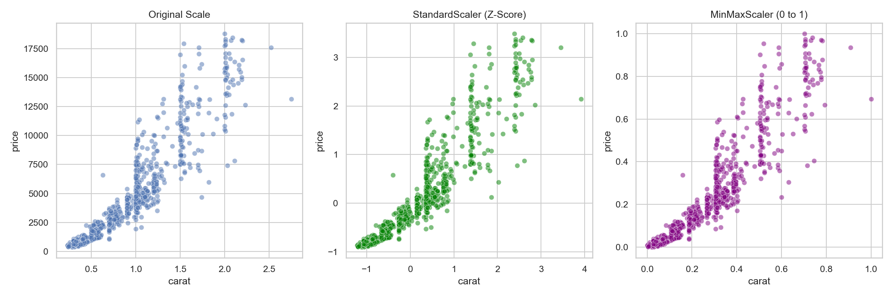

# Scaling & Normalisation

> Distance-based algorithms panic when comparing centimetres to kilometres. Scaling forces all features into immediate proportion.

## What You Will Learn
- Identify precisely when scaling is computationally required
- Compress variant features using `StandardScaler`
- Compress variant features using `MinMaxScaler`
- Visually verify transformation integrity via plotting

## Prerequisites
- Completed the *Data Types & Encoding* tutorial

## Step 1: Why Scaling Matters

Most ML algorithms (KNN, SVM, Neural Networks, PCA, K-Means) use raw Euclidean distance to calculate the difference between distinct data points.

If measuring houses, `Square Footage` might range from `800` to `5000`, while `Number of Bedrooms` ranges from `1` to `5`. Because the square footage numbers mathematically dominate the equation by three magnitudes, the algorithm practically ignores the bedroom count entirely. Scaling resets them both to the exact same comparable distribution box.

```python
import pandas as pd
import seaborn as sns
import matplotlib.pyplot as plt
from sklearn.preprocessing import StandardScaler, MinMaxScaler

df = sns.load_dataset('diamonds').head(1000)

print(f"Carat variance: {df['carat'].var():.4f}")
print(f"Price variance: {df['price'].var():.1f}")
```

??? example "Expected Output"
    ```text
    Carat variance: 0.2223
    Price variance: 15891338.8
    ```

## Step 2: Standardisation (Z-Score)

`StandardScaler` shifts the mean of the feature to exactly `0` and scales the variance tracking to exactly standard deviation `1`. This is the absolute default choice for linear scaling, assuming your underlying data structurally mimics a bell curve (Normal distribution).

```python
scaler_std = StandardScaler()

# Transform multiple columns simultaneously
features = ['carat', 'price']
df_std = pd.DataFrame(scaler_std.fit_transform(df[features]), columns=features)

print(df_std.describe().round(2))
```

??? example "Expected Output"
    | | carat | price |
    |---|---|---|
    | count | 1000.00 | 1000.00 |
    | mean | -0.00 | 0.00 |
    | std | 1.00 | 1.00 |
    | min | -1.13 | -0.91 |
    | 25% | -0.83 | -0.73 |
    | 50% | -0.22 | -0.32 |
    | 75% | 0.44 | 0.46 |
    | max | 4.88 | 3.65 |

Notice that the mean is functionally $0.00$ and the standard deviation is precisely $1.00$.

!!! tip "Workplace Tip"
    Tree-based algorithms (`RandomForest`, `XGBoost`, `DecisionTree`) are entirely immune to magnitude scaling because they split iteratively on percentile thresholds rather than geometric distances. If you are ONLY running trees at work, you can intentionally skip scaling routines completely!

## Step 3: Local Normalisation

`MinMaxScaler` compresses every single float strictly between the absolute lower boundary of `0.0` and `1.0`.

```python
scaler_minmax = MinMaxScaler()

df_mm = pd.DataFrame(scaler_minmax.fit_transform(df[features]), columns=features)

print(df_mm.describe().round(2))
```

??? example "Expected Output"
    | | carat | price |
    |---|---|---|
    | count | 1000.00 | 1000.00 |
    | mean | 0.19 | 0.20 |
    | std | 0.17 | 0.22 |
    | min | 0.00 | 0.00 |
    | 25% | 0.05 | 0.04 |
    | 50% | 0.15 | 0.13 |
    | 75% | 0.26 | 0.30 |
    | max | 1.00 | 1.00 |

Here the minimum is precisely $0.00$ and the maximum is precisely $1.00$. This is computationally highly desired as input arrays for deep learning Neural Networks.

## Step 4: Visualising Transformation Integrity

Scaling algorithms radically shift the underlying array magnitude, but critically *preserve relative correlation and proportion*. A scatter plot will look physically identical across the X and Y axes despite the array inputs dropping from 15,000,000 to 0.5.

```python
fig, axes = plt.subplots(1, 3, figsize=(15, 5))

# Original
sns.scatterplot(data=df, x='carat', y='price', alpha=0.5, ax=axes[0])
axes[0].set_title('Original Scale (Prices ~ $2000)')

# Standard Scaler
sns.scatterplot(data=df_std, x='carat', y='price', alpha=0.5, ax=axes[1], color='green')
axes[1].set_title('StandardScaler (Mean=0, STD=1)')

# MinMax Scaler
sns.scatterplot(data=df_mm, x='carat', y='price', alpha=0.5, ax=axes[2], color='purple')
axes[2].set_title('MinMaxScaler (Range 0-1)')

plt.tight_layout()
plt.show()
```

??? example "Expected Plot"
    

!!! info "Assessment Connection"
    You are structurally expected to invoke `.fit_transform()` on your `X_train` partitions, but critically strictly only `.transform()` on your `X_test` partitions! Do NOT accidentally invoke `.fit()` on tests or validation environments, as information "leakage" will artificially inflate your assessment results resulting in immediate capability failure.

## Summary
- Raw linear/geometric algorithms mandate equivalent spatial variance mapping.
- `StandardScaler` drives elements onto Z-scores centered around an absolute 0 framework.
- `MinMaxScaler` boxes extreme ranges aggressively into pure 0.0 to 1.0 decimals.
- Distance distributions physically remain visually parallel despite scalar compression.

## Next Steps
→ [Detecting & Treating Outliers](outliers.md) — handle the extreme anomalies that corrupt prediction accuracy and warp scalers.

??? challenge "Stretch & Challenge"
    ### For Advanced Learners
    
    **RobustScaler for High-Impact Anomaly Clusters**
    
    If your dataset contains massive anomalous outliers, they will physically drag the baseline mean calculations of `StandardScaler` severely towards their extreme polarity. 
    
    `RobustScaler` solves this by computing distance matrices exclusively against the median and IQR boundaries rather than the mean scalar.
    
    ```python
    from sklearn.preprocessing import RobustScaler
    
    scaler_robust = RobustScaler()
    df_robust = scaler_robust.fit_transform(df[['price']])
    ```
    
    Test `RobustScaler` on extremely skewed banking transactional tables to radically observe how much more cleanly normal behaviors remain mathematically bundled.

## KSB Mapping

| KSB | Description | How This Tutorial Addresses It |
|-----|-------------|-------------------------------|
| S4 | Import, cleanse, transform data | Rescaling features equivalently via Scikit-Learn |
| K5 | Machine Learning workflows | Distinguishing and preparing model-specific tensor arrays |
| B2 | Logical and analytical approach | Selecting scaling architecture accurately |
