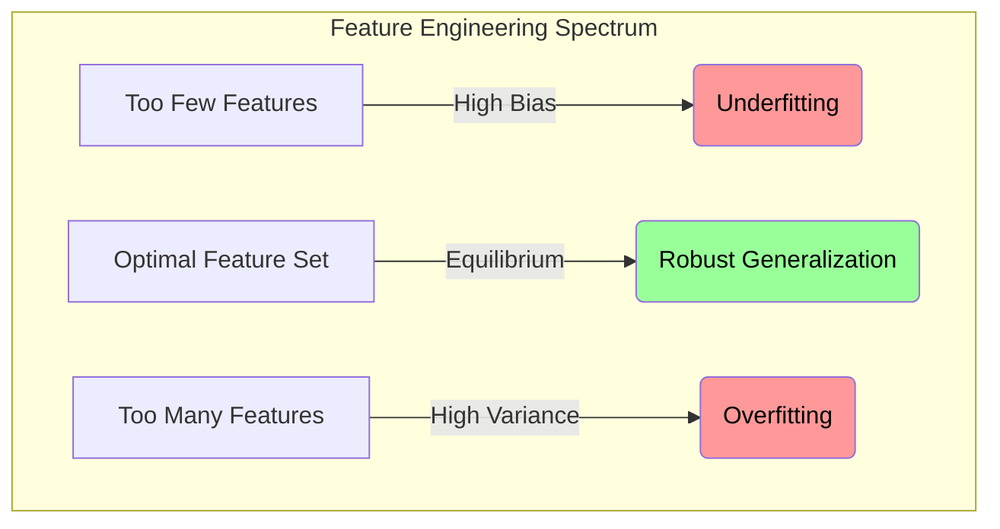

# Explanation: Bias-Variance Tradeoff (Feature Perspective)

## Conceptual Overview
The **Bias-Variance Tradeoff** is the central tension of all predictive modeling. You are constantly balancing a model's ability to understand the training data against its ability to generalize to new data. 

Feature engineering directly manipulates this scale. 

- **Bias** is the error introduced when a model is inherently too simple to capture the underlying pattern (Underfitting).
- **Variance** is the error introduced when a model is so highly complex that it memorizes the random noise in the training data (Overfitting).

\\[
Total Error = Bias^2 + Variance + Irreducible Error
\\]

## How Features Drive the Tradeoff

### Scenario A: High Bias (Underfitting)
By default, Linear Regression has high bias. It assumes the world is a straight line. If you are predicting the trajectory of a thrown baseball, a straight line will utterly fail.

**The Feature Engineering Fix:**
You inject complexity. You use `PolynomialFeatures(degree=2)` to engineer an $X^2$ term. You have purposefully *decreased the Bias* by allowing the model to curve, lowering the overall error.

### Scenario B: High Variance (Overfitting)
You are predicting Employee Attrition. You feed a Random Forest 300 highly granular features, including `Exact_Daily_Login_Time`, `Number_of_Keystrokes`, and `Mouse_Movement_Speed`. The model achieves 100% accuracy on the Training set. 

When deployed the next month, it achieves 45% accuracy. The model had massive Variance—it memorized the erratic noise of the training month rather than learning the core drivers of attrition.

**The Feature Engineering Fix:**
You inject simplicity. You utilize `SelectKBest` or `Lasso Recovery` to shred the 300 features down to the 10 most statistically stable dimensions (`Salary`, `Tenure`, `Commute_Distance`). You have purposefully *decreased the Variance*, lowering the overall error on novel data.

## Visualizing the Equilibrium

## Connection to Practice
During a technical interview or assessment presentation, you must be able to justify *why* you pruned the dataset. 

Stating "I used RFE to select 5 features because the documentation said so" is a failing answer. 

Stating "I utilized Recursive Feature Elimination to prune 45 redundant dimensions, purposefully suppressing the model's structural Variance to prevent dataset memorization" demonstrates master-level comprehension.
