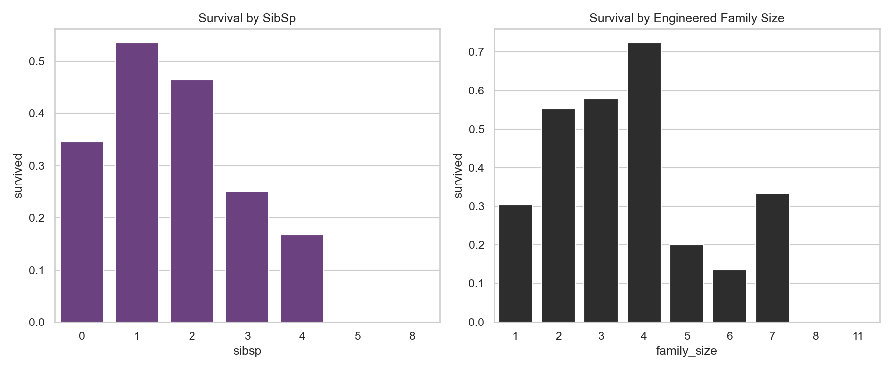

# Creating Features from Existing Data

> Data Preparation cleans what you have. Feature Engineering creates what you don't.

## What You Will Learn
- Define the architectural difference between Preparation and Engineering
- Construct new predictive signals from existing scalar columns
- Use Domain Knowledge to encode complex business logic into integers

## Prerequisites
- Completed Topic 1 (Data Preparation)
- Understanding of independent variables (Features / `X`)

## Step 1: Mathematical Transformations

The simplest feature engineering involves applying basic arithmetic to existing columns to generate a new metric that explains the business problem better.

Using the `titanic` dataset, an algorithm tracking `sibsp` (siblings/spouses) and `parch` (parents/children) separately might miss the broader concept of "Total Family Size". If larger families survive differently than individuals, we must engineer that signal explicitly.

```python
import pandas as pd
import seaborn as sns
import matplotlib.pyplot as plt

df = sns.load_dataset('titanic')

# Feature Engineering: simple arithmetic combination
df['family_size'] = df['sibsp'] + df['parch'] + 1  # +1 for the passenger themselves

print(df[['sibsp', 'parch', 'family_size']].head())
```

??? example "Expected Output"
    ```text
       sibsp  parch  family_size
    0      1      0            2
    1      1      0            2
    2      0      0            1
    3      1      0            2
    4      0      0            1
    ```

Let's test if our engineered feature actually isolates a stronger signal than the raw data:

```python
fig, axes = plt.subplots(1, 2, figsize=(12, 5))

sns.barplot(data=df, x='sibsp', y='survived', ax=axes[0], errorbar=None, color='#6E368A')
axes[0].set_title('Survival by SibSp')

sns.barplot(data=df, x='family_size', y='survived', ax=axes[1], errorbar=None, color='#2D2D2D')
axes[1].set_title('Survival by Engineered Family Size')

plt.tight_layout()
plt.show()
```

??? example "Expected Plot"
    

The rightmost chart now clearly shows a parabolic survival curve: individuals (1) and massive families (6+) died, while medium families (2-4) survived. We captured a complex sociological truth purely with `+` signs!

## Step 2: Binning Continuous Values (Discretization)

Algorithms like Decision Trees split numbers arbitrarily. Sometimes, human domain boundaries (e.g. Legal Adult = 18) possess infinitely stronger predictive power than raw continuous distributions.

We can bin the `age` column dynamically into logical demographic categories using `pd.cut()`.

```python
# Define the arbitrary numeric boundaries and the human labels
bins = [0, 12, 18, 60, 120]
labels = ['Child', 'Teen', 'Adult', 'Senior']

# Execute the cut
df['age_group'] = pd.cut(df['age'], bins=bins, labels=labels)

print(df[['age', 'age_group']].head(6))
```

??? example "Expected Output"
    ```text
        age age_group
    0  22.0     Adult
    1  38.0     Adult
    2  26.0     Adult
    3  35.0     Adult
    4  35.0     Adult
    5   NaN       NaN
    ```

!!! tip "Workplace Tip"
    Do not randomly bin continuous data just because you can! You are mathematically destroying variance (shrinking 100 possible ages into 4 categories). ONLY use `pd.cut()` when explicit business thresholds exist (e.g. Tax Brackets, Legal Drinking Age) that the algorithm is failing to discover natively.

## Step 3: Polynomial Features

If a relationship between `X` and `Y` is curved rather than a straight line, standard linear regressions will fail completely. You must manually generate exponential features ($x^2, x^3$) to allow the line to bend organically.

```python
from sklearn.preprocessing import PolynomialFeatures
import numpy as np

# Synthesize a tiny dataset
X = np.array([[2], [3], [4]])

# Instatiate a Polynomial compiler to generate x^2 components
poly = PolynomialFeatures(degree=2, include_bias=False)
X_poly = poly.fit_transform(X)

print(f"Original X:\n{X}\n")
print(f"Polynomial X (x, x^2):\n{X_poly}")
```

??? example "Expected Output"
    ```text
    Original X:
    [[2]
     [3]
     [4]]
    
    Polynomial X (x, x^2):
    [[ 2.  4.]
     [ 3.  9.]
     [ 4. 16.]]
    ```

By passing `X_poly` into a linear regression model, you mathematically allow a straight line algorithm to trace a parabolic curve!

## Summary
- **Mathematical Combinations** merge redundant baseline columns into stronger solitary signals.
- **Discretization (Binning)** forces algorithms to respect explicit domain-knowledge thresholds.
- **Polynomials** unlock curved analysis inside strictly linear analytical algorithms.

## Next Steps
→ [Datetime & Text Features](datetime-text-features.md) — parse complex cyclical timeseries strings into distinct geographic or chronological columns.

??? challenge "Stretch & Challenge"
    ### For Advanced Learners
    
    **Automated Feature Engineering Tooling**
    
    If your dataset has 50 columns, manually deriving interactions like `col1 * col3` or `col4 / col10` requires thousands of human hours and results in 2,500 new columns.
    
    Look into **FeatureTools** — an open-source library that automates deep feature synthesis relationally.
    
    ```python
    import featuretools as ft
    
    # FeatureTools automatically multiplies, divides, and groups every column
    # against every other column automatically to hunt for hyper-signals.
    feature_matrix, feature_defs = ft.dfs(
        dataframes=dataframes,
        relationships=relationships,
        target_dataframe_name="customers"
    )
    ```
    
    This is highly computationally expensive but routinely wins Kaggle competitions.

## KSB Mapping

| KSB | Description | How This Addresses It |
|-----|-------------|-------------------------------|
| K4.2 | Advanced analytics and ML techniques | Feature selection algorithms and dimensionality reduction |
| K5.2 | Data formats and structures | Encoding categorical variables, handling mixed feature types |
| S2 | Data engineering | Creating and transforming features from raw data |
| S4 | Feature selection and ML | Applying feature selection methods and PCA |
| B1 | Inquisitive approach | Exploring creative feature engineering strategies |
