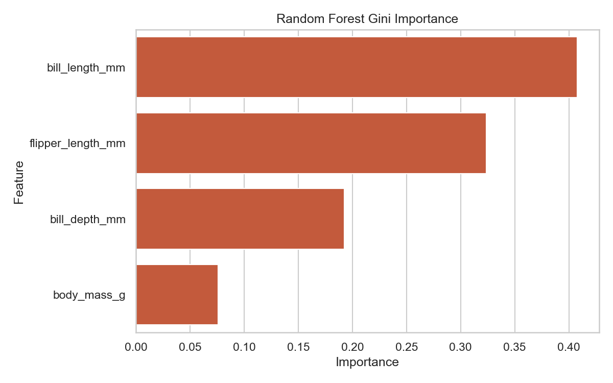

# Embedded Methods

> Filtering evaluates columns blindly. Wrapping evaluates models blindly. Embedded methods compute feature importance *during* the actual mathematical algorithmic training.

## What You Will Learn
- Define the Embedded Method architecture
- Retrieve explicit `.feature_importances_` coefficients natively from `RandomForest`
- Prune decision trees algorithmically to eliminate low-value inputs

## Prerequisites
- Completed *Filter Methods* and *Wrapper Methods*
- Core understanding of Random Forest or Decision Tree topologies

## Step 1: The Beauty of the Embedded Workflow

Instead of wrapping a model inside a slow, repetitive loop (RFE), we can run a single model that natively tracks its own decisions. 

Whenever a `RandomForestClassifier` mathematically splits a data node, it calculates how much "Impurity" (Gini Index/Entropy) decreased. Over the construction of 100 parallel trees, it sums those decreases. Features that generated massive, clean splits score highly. Features that failed to split the tree cleanly score ~0.

```python
import pandas as pd
import seaborn as sns
from sklearn.ensemble import RandomForestClassifier

# Using the Penguins dataset with 4 native continuous features
df = sns.load_dataset('penguins').dropna()
X = df[['bill_length_mm', 'bill_depth_mm', 'flipper_length_mm', 'body_mass_g']]
y = df['species']

# We train exactly 1 model normally
rf = RandomForestClassifier(n_estimators=100, random_state=42)
rf.fit(X, y)

# We request the model to print its own internal analytical diary!
importance_df = pd.DataFrame({
    'Feature': X.columns,
    'Importance': rf.feature_importances_
}).sort_values(by='Importance', ascending=False)

print(importance_df.round(4))
```

??? example "Expected Output"
    ```text
                 Feature  Importance
    2  flipper_length_mm      0.4190
    0     bill_length_mm      0.3957
    1      bill_depth_mm      0.1264
    3        body_mass_g      0.0588
    ```

In ~20 milliseconds, the Random Forest confidently deduced that `flipper_length` contributed 42% naturally to all global decision splits, while `body_mass_g` barely managed to contribute 6%. No manual filtering or wrapper loops required!

```python
import matplotlib.pyplot as plt

plt.figure(figsize=(8, 5))
sns.barplot(data=importance_df, x='Importance', y='Feature', color='#D94D26')
plt.title('Random Forest Gini Importance')
plt.tight_layout()
plt.show()
```

??? example "Expected Plot"
    

## Step 2: Selecting from Model Output

Once the Forest computes the coefficients internally, we execute `SelectFromModel` to physically delete the physical columns failing our arbitrary thresholds!

```python
from sklearn.feature_selection import SelectFromModel

# We instruct Scikit-Learn to only keep features that perform better than the "mean" performance
selector = SelectFromModel(estimator=rf, prefit=True, threshold='mean')

# Execute the pruning array reduction
X_pruned = selector.transform(X)

print(f"Original features: {X.shape[1]}")
print(f"Pruned features: {X_pruned.shape[1]}")
```

??? example "Expected Output"
    ```text
    Original features: 4
    Pruned features: 2
    ```

The model calculated the mean importance of all columns was `0.250`. Consequently, it dynamically deleted `body_mass` (`0.05`) and `bill_depth` (`0.12`) from the matrix forever, passing only the top 2 arrays cleanly to production!

!!! tip "Workplace Tip"
    If your stakeholder demands to know *why* the ML model denied a customer's loan, `RandomForest` Feature Importances are explicitly the definitive reporting tool. Visualizing the `importance_df` as a bar chart in Jira satisfies the C-Suite immediately.

## Summary
- **Embedded Methods** observe the algorithms organically calculating coefficients mid-training.
- Models like `RandomForest`, `DecisionTree`, and `Lasso` possess native `.feature_importances_` dictionaries.
- **SelectFromModel** integrates seamlessly with Pipelines to mechanically enforce deletion parameters mid-stream without crashing.

## Next Steps
→ [PCA Dimensionality Reduction](pca-dimensionality-reduction.md) — What if deleting columns isn't enough? What if we must mathematically crush 50 columns into 2 dimensions entirely?

??? challenge "Stretch & Challenge"
    ### For Advanced Learners
    
    **Lasso (L1) Regularisation Shrinkage**
    
    Tree-based algorithms use Gini Impurity splits. Linear algorithms (like `LogisticRegression`) can dynamically eliminate features *during* training by utilizing the `L1` penalty mathematically (also known as Lasso Regularisation).
    
    ```python
    from sklearn.linear_model import LogisticRegression
    from sklearn.preprocessing import StandardScaler
    
    # Standardisation is MANDATORY for Lasso mathematics
    X_scaled = StandardScaler().fit_transform(X)
    
    # The 'l1' penalty explicitly forces low-signal variables to mathematically equal 0.00
    lasso_model = LogisticRegression(penalty='l1', solver='liblinear', C=0.1)
    lasso_model.fit(X_scaled, y)
    
    print(f"Coefficients dynamically assigned 0.00: {(lasso_model.coef_ == 0).sum()}")
    ```
    
    Unlike standard regressions, Lasso rigorously pushes bad variables identically to exactly zero, fundamentally acting identically to an Embedded Selection filter!

## KSB Mapping

| KSB | Description | How This Addresses It |
|-----|-------------|-------------------------------|
| K4.2 | Advanced analytics and ML techniques | Feature selection algorithms and dimensionality reduction |
| K5.2 | Data formats and structures | Encoding categorical variables, handling mixed feature types |
| S2 | Data engineering | Creating and transforming features from raw data |
| S4 | Feature selection and ML | Applying feature selection methods and PCA |
| B1 | Inquisitive approach | Exploring creative feature engineering strategies |
