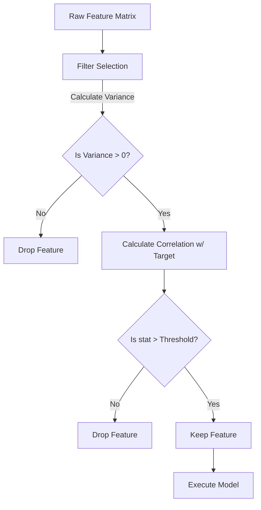

# Filter Selection Methods

> "If you torture the data long enough, it will confess to anything." — Ronald Coase

## What You Will Learn

- Implement univariate filter methods (`SelectKBest`)
- Understand Pearson Correlation and Mutual Information
- Utilize `VarianceThreshold` to drop static variables

## Prerequisites

- [Creating Features from Raw Data](creating-features.md)
- [DateTime & Text Features](datetime-text-features.md)

## Step 1: Why Feature Selection?

If you just generated 500 new columns utilizing One-Hot Encoders, interaction terms, and TF-IDF matrices, your dataset is now dangerously vast. Feeding everything to an algorithm causes:
1. Massive computation times
2. Severe Overfitting (The Curse of Dimensionality)
3. Destruction of interpretability

**Filter Methods** are the fastest, simplest way to reduce dimensions. They calculate statistical properties of each feature independent from the modeling algorithm.



## Step 2: Variance Threshold

If a feature consists identically of the value `1.0` for 99.9% of all rows, it contains zero predictive variance. The model cannot learn anything from it.

```python
import pandas as pd
from sklearn.feature_selection import VarianceThreshold

data = pd.DataFrame({
    'Age': [25, 30, 35, 40],
    'Constant_Value': [1, 1, 1, 1], # 0 Variance
    'Binary_Flag': [1, 1, 1, 0]     # Low Variance
})

# Threshold of 0 removes entirely static columns
vt = VarianceThreshold(threshold=0)
data_high_variance = pd.DataFrame(vt.fit_transform(data), 
                                  columns=data.columns[vt.get_support()])

print("Filtered DataFrame:\\n", data_high_variance)
```

## Step 3: Correlation Filters (SelectKBest)

Once static columns are removed, we filter based on a feature's statistical relationship directly to the prediction Target (`y`).

```python
from sklearn.datasets import load_breast_cancer
from sklearn.feature_selection import SelectKBest, f_classif

# Load highly dimensional dataset (30 features)
X, y = load_breast_cancer(return_X_y=True, as_frame=True)

# We only want the Top 5 most important features based on the ANOVA F-Value
selector = SelectKBest(score_func=f_classif, k=5)
X_selected = selector.fit_transform(X, y)

# Retrieve the names of the winning columns
selected_features = X.columns[selector.get_support()]
print("The 5 most statistically significant features are:")
for f in selected_features:
    print(f"- {f}")
```

### Which Statistical Score to Use?

| Target Variable | Feature Variable | Recommended `score_func` |
|-----------------|------------------|--------------------------|
| Continuous (Regression) | Continuous | `f_regression` (Pearson Correlation) |
| Continuous (Regression) | Categorical | `mutual_info_regression` |
| Categorical (Classif) | Continuous | `f_classif` (ANOVA F-Value) |
| Categorical (Classif) | Categorical | `chi2` or `mutual_info_classif` |

## Summary

Filter methods are lightning-fast mathematical computations executed *before* models are ever deployed. They act as the primary defense against the Curse of Dimensionality.

## Next Steps

→ [Wrapper Selection Methods](wrapper-methods.md)

## KSB Mapping

| KSB | Description | How This Tutorial Addresses It |
|-----|-------------|-------------------------------|
| K1 | Statistical Concepts | Implements ANOVA F-Values and Variance logic |
| S1 | Apply statistical methods | Utilizes `SelectKBest` directly from SKLearn architecture |
