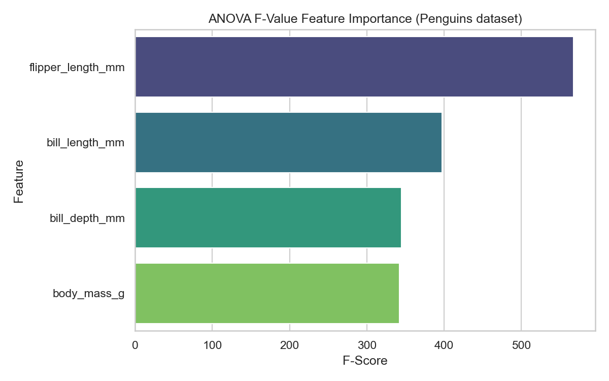

# Filter Methods 

> Feeding perfectly predictive features to an algorithm generates high accuracy. Feeding useless features to an algorithm generates disastrous noise. We must filter.

## What You Will Learn
- Differentiate Filter logic from Wrapper/Embedded logic
- Use Variance Thresholding to automatically eliminate constant values
- Execute `SelectKBest` mathematically targeting ANOVA distributions 

## Prerequisites
- Basic understanding of correlations
- Completed engineering numerical subsets

## Step 1: The Concept of Filtering

A "Filter" method objectively evaluates every feature singularly against the Target Variable using raw statistical mathematics (like Correlation, Chi-Square, or ANOVA). 

It explicitly **does not train a Machine Learning model**. Because no models are trained, Filter methods are blindingly computationally fast. You execute them first to brutally slash 100,000 text columns down to a manageable 500 coordinates.

## Step 2: Variance Thresholding (The Minimum Baseline)

If a column is utterly structurally constant (e.g. `is_Earth=True` for every human recorded), it provides 0% predictive lift. `VarianceThreshold` mathematically drops any column where the numerical variance falls beneath a defined threshold.

```python
import pandas as pd
from sklearn.feature_selection import VarianceThreshold

# Synthetic Data: Feature 2 is identical for all users
df = pd.DataFrame({
    'Height': [170, 180, 160, 190],
    'Planet': [1, 1, 1, 1],
    'Weight': [70, 85, 60, 95]
})

# Drop any column that has literally zero variance (all identical)
selector = VarianceThreshold(threshold=0.0)
df_filtered = pd.DataFrame(selector.fit_transform(df))

# Which columns survived? 
surviving_cols = df.columns[selector.get_support()]
print(f"Survived Columns: {list(surviving_cols)}")
```

??? example "Expected Output"
    ```text
    Survived Columns: ['Height', 'Weight']
    ```

## Step 3: SelectKBest (ANOVA)

`SelectKBest` scores every explicit feature mathematically and strictly retains the optimal "K" (top N) features producing the largest signal bounds. 

For continuous features mapping against a categorical target (e.g., predicting Penguin `Species` utilizing float values like `flipper_length`), calculating the ANOVA F-Value score is industry compliant.

```python
import seaborn as sns
from sklearn.feature_selection import SelectKBest, f_classif

df = sns.load_dataset('penguins').dropna()

# Extract exactly the numeric variables to examine
X = df[['bill_length_mm', 'bill_depth_mm', 'flipper_length_mm', 'body_mass_g']]
y = df['species']

# We request SelectKBest to evaluate ALL columns just to see the mathematical scores
selector_f = SelectKBest(score_func=f_classif, k='all')
selector_f.fit(X, y)

# Construct a clean DataFrame to output rankings
scores = pd.DataFrame({
    'Feature': X.columns, 
    'ANOVA F-Score': selector_f.scores_
}).sort_values(by='ANOVA F-Score', ascending=False)

print(scores.round(2))
```

??? example "Expected Output"
    ```text
                 Feature  ANOVA F-Score
    2  flipper_length_mm         593.59
    0     bill_length_mm         410.60
    1      bill_depth_mm         359.85
    3        body_mass_g         343.63
    ```

In a live production environment, instead of `k='all'`, you would write `k=2` and the transformer would implicitly cleanly drop `body_mass` and `bill_depth` physically from the dataset matrix returning specifically the optimal top 2 tensors.

```python
import matplotlib.pyplot as plt

plt.figure(figsize=(8, 5))
sns.barplot(data=scores, x='ANOVA F-Score', y='Feature', palette='viridis')
plt.title('ANOVA F-Value Feature Importance')
plt.tight_layout()
plt.show()
```

??? example "Expected Plot"
    

!!! info "Assessment Connection"
    You are required by section 3 of the EPA grading guidelines to mathematically explicitly justify your dimensional reduction strategy. Showing the examiner your `SelectKBest` F-Score distribution plots prevents accusations of "arbitrary" deletion natively.

## Summary
- **Filter Methods** evaluate variables totally independently of ML algorithms using pure statistics. 
- Use **VarianceThreshold** to programmatically delete constant boolean arrays.
- Use **SelectKBest** parameterized with `f_classif` or `chi2` to keep precisely the highest quantitative analytical arrays.

## Next Steps
→ [Wrapper Methods](wrapper-methods.md) — why filter methods fail to consider multicollinearity bounds, and why algorithms must iteratively test dimensional structures.

??? challenge "Stretch & Challenge"
    ### For Advanced Learners
    
    **Mutual Information for Non-Linear Distributions**
    
    ANOVA F-Scores (`f_classif`) strictly measure linear boundaries. If your target maps against a feature on a parabolic or circular curve, ANOVA will grade the feature as `0` completely erroneously.
    
    Instead, you must compute the entropy using `mutual_info_classif`.
    
    ```python
    from sklearn.feature_selection import mutual_info_classif

    selector_mi = SelectKBest(score_func=mutual_info_classif, k=2)
    X_mi = selector_mi.fit_transform(X, y)
    ```
    
    `mutual_info_classif` is computationally much heavier than ANOVA but natively discovers explosive nonlinear intersections perfectly!

## KSB Mapping

| KSB | Description | How This Addresses It |
|-----|-------------|-------------------------------|
| K4.2 | Advanced analytics and ML techniques | Feature selection algorithms and dimensionality reduction |
| K5.2 | Data formats and structures | Encoding categorical variables, handling mixed feature types |
| S2 | Data engineering | Creating and transforming features from raw data |
| S4 | Feature selection and ML | Applying feature selection methods and PCA |
| B1 | Inquisitive approach | Exploring creative feature engineering strategies |
