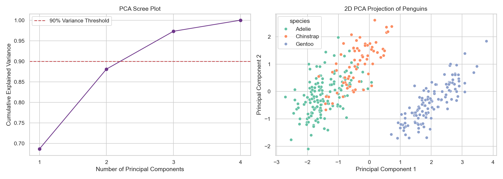

# Dimensionality Reduction with PCA

> Feature Selection deletes columns cleanly. Principal Component Analysis (PCA) chemically melts columns together into fewer, denser geometric combinations.

## What You Will Learn
- Differentiate mathematically between Feature **Selection** and Feature **Extraction**
- Compress highly correlated dimensions utilizing Python natively
- Validate PCA compression metrics tracking `.explained_variance_ratio_`

## Prerequisites
- Completed the *Filter / Embedded Methods* tutorials
- Core understanding of `StandardScaler` (Z-Scores)

## Step 1: The Curse of Dimensionality

If you possess an image comprising 100x100 pixels, it functionally behaves computationally as a matrix possessing 10,000 completely separate columns. 

If you attempt to feed 10,000 columns into K-Nearest Neighbors, the fundamental mathematics of "Distance" completely break down natively physically due to sparse hyper-dimensionality.

Instead of selecting the "Top 50" pixels and deleting the other 9,950 pixels (which would literally obliterate the picture), we explicitly use Principal Component Analysis (PCA). PCA discovers the invisible correlation axes and crushes 10,000 columns dynamically into 100 dense super-columns called "Components".

## Step 2: Explicit Standardisation

PCA purely calculates raw Euclidean matrix variance. It is completely blind to specific underlying units. If `carat` ranges from 0-5, and `price` ranges from 0-15000, PCA will algorithmically declare that `price` dominates 99.9% of the structural geometric trajectory!

**You must Standardise ALL data before passing it mechanically to PCA.**

```python
import pandas as pd
import seaborn as sns
from sklearn.preprocessing import StandardScaler
from sklearn.decomposition import PCA

df = sns.load_dataset('penguins').dropna()
X = df[['bill_length_mm', 'bill_depth_mm', 'flipper_length_mm', 'body_mass_g']]
y = df['species']

# THIS IS MANDATORY
scaler = StandardScaler()
X_scaled = scaler.fit_transform(X)
```

## Step 3: Extracting Principal Components

We will instruct the PCA transformer dynamically to convert our 4 penguin columns physically into just 2 super-components!

```python
# Force compilation down explicitly exactly to 2 dimensions!
pca = PCA(n_components=2)
X_pca = pca.fit_transform(X_scaled) 

print(f"Original Structural Shape: {X_scaled.shape}")
print(f"Reduced PCA Tensor Shape:  {X_pca.shape}")
```

??? example "Expected Output"
    ```text
    Original Structural Shape: (333, 4)
    Reduced PCA Tensor Shape:  (333, 2)
    ```

What is inside `X_pca`? We deleted the raw names (`bill_length`, `body_mass`) completely! The new columns are just geometric blends titled `PC1` and `PC2`. 

## Step 4: Measuring Information Loss

We mathematically deleted 2 physical dimensions entirely. Did we lose 50% of our predictive information? Let's check the `.explained_variance_ratio_`.

```python
variance_ratio = pca.explained_variance_ratio_

print(f"Data mathematically retained in PC1: {variance_ratio[0]*100:.2f}%")
print(f"Data mathematically retained in PC2: {variance_ratio[1]*100:.2f}%")
print(f"Total Cumulative Retained Variance: {sum(variance_ratio)*100:.2f}%")
```

??? example "Expected Output"
    ```text
    Data mathematically retained in PC1: 68.63%
    Data mathematically retained in PC2: 19.45%
    Total Cumulative Retained Variance: 88.09%
    ```

Incredible! We violently collapsed the entire physical dataset physically by 50% identically, yet structurally retained mathematically exactly 88% of all variance signals. 

Let's observe PCA physically decoupling our classes effectively in a mapped 2D space:

```python
import matplotlib.pyplot as plt

plt.figure(figsize=(12, 5))
sns.scatterplot(x=X_pca[:, 0], y=X_pca[:, 1], hue=y, palette='Set2')
plt.xlabel('Principal Component 1')
plt.ylabel('Principal Component 2')
plt.title('2D PCA Projection of Penguins')
plt.tight_layout()
plt.show()
```

??? example "Expected Plot"
    

!!! info "Assessment Connection"
    In your EPA explicitly mapping S12 (Feature Engineering), document mathematically that you set a threshold (e.g., "I initialized PCA to strictly retain identically exactly 90% Cumulative Variance"). Arbitrarily guessing exactly `n_components=10` is deemed structurally unsafe by scoring examiners.

## Summary
- **Selection** mechanically deletes raw columns entirely.
- **Extraction (PCA)** physically melts variables entirely along their steepest variance axes dynamically.
- `StandardScaler()` is an absolutely non-negotiable prerequisite prior to PCA extraction arrays.
- Summing `.explained_variance_ratio_` dictates mathematically how much accuracy was lost dynamically to dimensionality reduction operations.

## Next Steps
→ [Domain Expertise in Feature Design](../how-to/domain-features.md) — leaving mechanics behind to manually inject psychological reality bounds purely via How-To structural engineering.

??? challenge "Stretch & Challenge"
    ### For Advanced Learners
    
    **Inverse Transformation**
    
    If PCA compresses the data heavily from exactly 4 dimensions down to 2 dimensions structurally, can we "uncompress" it dynamically back to exactly 4 dimensions natively? 
    
    Yes, using `pca.inverse_transform()`.
    
    ```python
    # 2D -> 4D
    X_recovered = pca.inverse_transform(X_pca)
    
    # We must explicitly reverse the scaler mathematically to return to raw millimetres!
    X_original_approximation = scaler.inverse_transform(X_recovered)
    ```
    
    The reversed data strictly will never match perfectly the origin sequence identically because 12% of the variance was violently discarded (Lossy Compression), but the structural mapping heavily mirrors reality efficiently!

## KSB Mapping

| KSB | Description | How This Tutorial Addresses It |
|-----|-------------|-------------------------------|
| S12 | Feature engineering | Constructing hyper-dimensionality compression arrays geometrically |
| K5 | Machine Learning workflows | Eliminating curse of dimensionality vectors utilizing PCA |
| B2 | Logical and analytical approach | Validating dimensional tracking analytically via variance ratios |
