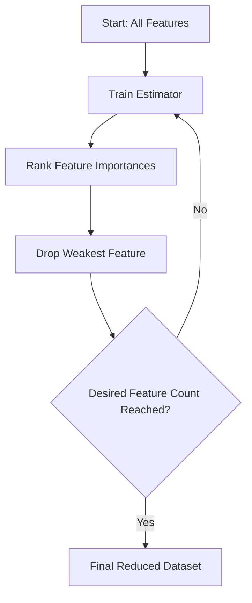

# Wrapper Selection Methods

> "If Filter methods are the shotgun approach, Wrapper methods are the sniper rifle. They are slow, methodical, and aggressively accurate."

## What You Will Learn

- Implement Recursive Feature Elimination (RFE)
- Cross-Validate feature elimination (RFECV)
- Implement Sequential Feature Selection (Forward/Backward Stepwise)

## Prerequisites

- [Filter Selection Methods](filter-methods.md)
- Familiarity with the `scikit-learn` Pipeline API

## Step 1: Why Wrapper Methods?

**Wrapper Methods** evaluate subsets of features by training an *actual* machine learning model (the "wrapper") on varying combinations of features and measuring the evaluation metric (e.g., Accuracy, R-Squared). 

Because it trains a real model thousands of times, it is computationally devastating, but mathematically superior to simple Filter checks which ignore how features interact *together*.



## Step 2: Recursive Feature Elimination (RFE)

RFE trains a model, extracts the `coef_` or `feature_importances_` attribute, drops the lowest-ranking feature, and rebuilds the model from scratch. It repeats recursively until you reach the target `n_features_to_select`.

```python
import pandas as pd
from sklearn.datasets import make_friedman1
from sklearn.feature_selection import RFE
from sklearn.tree import DecisionTreeRegressor
import matplotlib.pyplot as plt

# Generate a synthetic regression dataset with 10 features
# only 5 of these features are actually linked to the target 'y'!
X, y = make_friedman1(n_samples=500, n_features=10, random_state=42)
X_df = pd.DataFrame(X, columns=[f'Feature_{i}' for i in range(1, 11)])

# 1. Define the Estimator
estimator = DecisionTreeRegressor(random_state=42)

# 2. Define the RFE strategy (Select exactly 5 features)
selector = RFE(estimator, n_features_to_select=5, step=1)
selector = selector.fit(X_df, y)

# 3. View the boolean masks
print("Feature Ranking Matrix:")
for i, feature in enumerate(X_df.columns):
    status = "SELECTED" if selector.support_[i] else "DROPPED"
    print(f"{feature}: Rank {selector.ranking_[i]} ({status})")
```

## Step 3: Optimal Feature Count (RFECV)

How do you know what `n_features_to_select` should be? You don't. 

**RFECV** (Recursive Feature Elimination with Cross-Validation) automates this by plotting performance at every step and mathematically selecting the peak.

```python
from sklearn.feature_selection import RFECV

# Create the automated Cross-Validated wrapper
min_features_to_select = 1
rfecv = RFECV(
    estimator=estimator,
    step=1,
    cv=5, # 5-Fold Cross Validation
    scoring="neg_mean_squared_error",
    min_features_to_select=min_features_to_select,
    n_jobs=-1 # run in parallel
)
rfecv.fit(X, y)

print(f"Optimal number of features: {rfecv.n_features_}")

# Visualizing the performance drop as features are eliminated
plt.figure()
plt.xlabel("Number of features selected")
plt.ylabel("CV Score (Negative MSE)")
plt.plot(range(min_features_to_select, len(rfecv.cv_results_['mean_test_score']) + min_features_to_select),
         rfecv.cv_results_['mean_test_score'])
plt.title("RFECV Automated Feature Pruning")
plt.show()
```

!!! warning "Model Dependence"
    RFE only works with algorithms that expose `coef_` (Linear Models, SVM) or `feature_importances_` (Trees, Random Forest, XGBoost). You cannot pass KNN into an RFE because KNN does not rank features internally.

## Step 4: Sequential Feature Selector (SFS)

If your model lacks `coef_` (like KNN), you must use **SFS**. 
- **Forward SFS:** Starts with 0 features. Tries adding every single feature individually, keeps the single best one. Repeats until target reached.
- **Backward SFS:** Acts identically to RFE but drops based on overall metric degradation.

```python
from sklearn.feature_selection import SequentialFeatureSelector
from sklearn.neighbors import KNeighborsRegressor

knn = KNeighborsRegressor(n_neighbors=3)
# Forward stepwise selection
sfs = SequentialFeatureSelector(knn, n_features_to_select=3, direction='forward')
sfs.fit(X, y)

print("SFS Selected indices:", sfs.get_support(indices=True))
```

## Summary

Wrapper methods find the perfect subset sequence. In production environments where API latency dictates model speed, using RFE to slash features from 500 down to 20 without losing accuracy is a masterstroke.

## Next Steps

→ [Embedded Selection Methods](embedded-methods.md)

## KSB Mapping

| KSB | Description | How This Tutorial Addresses It |
|-----|-------------|-------------------------------|
| S2 | Apply machine learning | Recursively building estimators to validate models |
| B2 | Logical approach | Cross-validating computational metrics dynamically |
