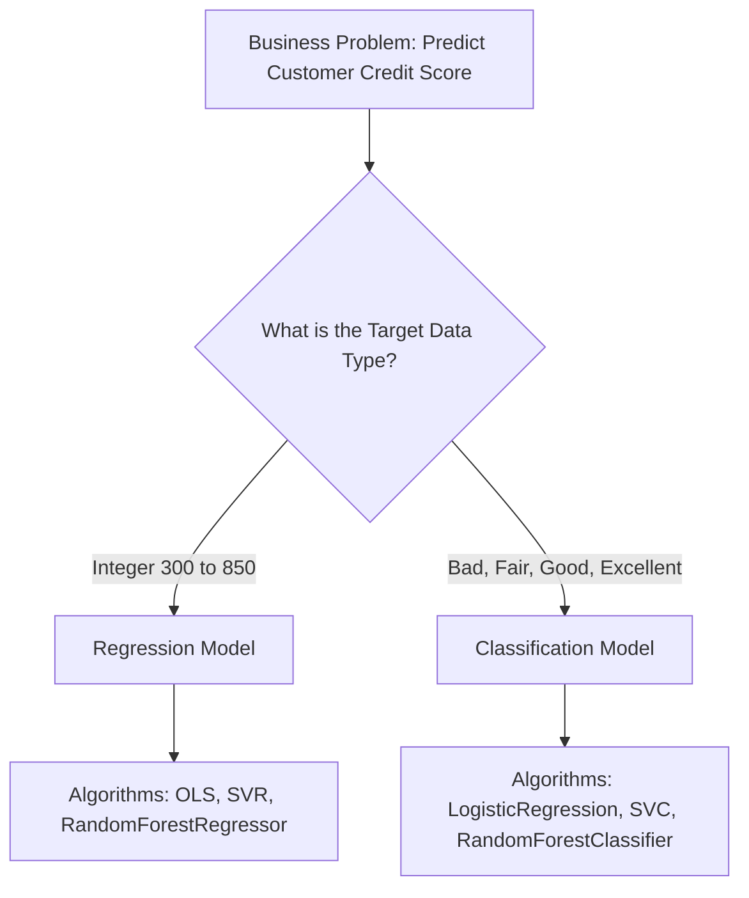

# Explanation: Regression vs. Classification

## Conceptual Overview
The single most critical decision a Data Scientist makes happens before a single line of code is written: **What kind of problem am I solving?**

Machine Learning is broadly split into two supervised learning paradigms: **Regression** and **Classification**. The distinction entirely revolves around the mathematical nature of the Target Variable ($y$).

## 1. Regression (Predicting a Quantity)
If the answer to your business problem is a measurable, continuous number, you are solving a Regression problem.

- *“How much will this house sell for?”* (£540,200)
- *“How many users will visit the site tomorrow?”* (14,320)
- *“What will the temperature be?”* (14.2°C)

### The Mathematics of Regression
Because the output is continuous, a Regression algorithm can predict novel values that have never existed in history. If the highest house price in your training data is £1 Million, the Regression model can mathematically predict that a new mansion is worth £1.5 Million by simply extending its gradient trajectory.

**Evaluation:** You measure success by calculating the average physical distance between your prediction and reality (e.g., Mean Absolute Error: "I was off by £5,000 on average").

## 2. Classification (Predicting a Category)
If the answer to your business problem is a discrete bucket, label, or choice, you are solving a Classification problem.

- *“Is this email Spam or Not Spam?”* (Binary)
- *“Will this customer Churn or Renew?”* (Binary)
- *“Is this image a Dog, Cat, or Bird?”* (Multi-class)

### The Mathematics of Classification
Classification algorithms do not predict quantities; they predict **Probabilities**. 
When a Neural Network analyzes an image of a dog, it does not output the word "Dog". It outputs: `[Dog: 0.95, Cat: 0.04, Bird: 0.01]`. 

We apply a threshold (usually 0.5) to snap the highest probability into a firm Categorical decision. Unlike Regression, Classification models *cannot* predict novel values. If you train a model on "Dog/Cat/Bird" and show it a picture of a Horse, it is mathematically forced to guess one of the three original categories.

**Evaluation:** You measure success using logical truth tables (Confusion Matrix: "Out of 100 actual Spam emails, how many did I correctly catch?").

## The Trap: Misidentification

### The Assessment Pitfall
A common critical failure in the L6 Data Science examination is utilizing a `Classifier` algorithm to predict a `Continuous` target, or vice versa. 

If you attempt to feed a continuous Salary target into `LogisticRegression`, the python interpreter will try to map every single unique integer (e.g., £45,001, £45,002) as a completely separate Classification Category, immediately crashing your memory allocation with a dimensional explosion.

## Summary Checklist
- Target is a number = Regressor
- Target is a class = Classifier
