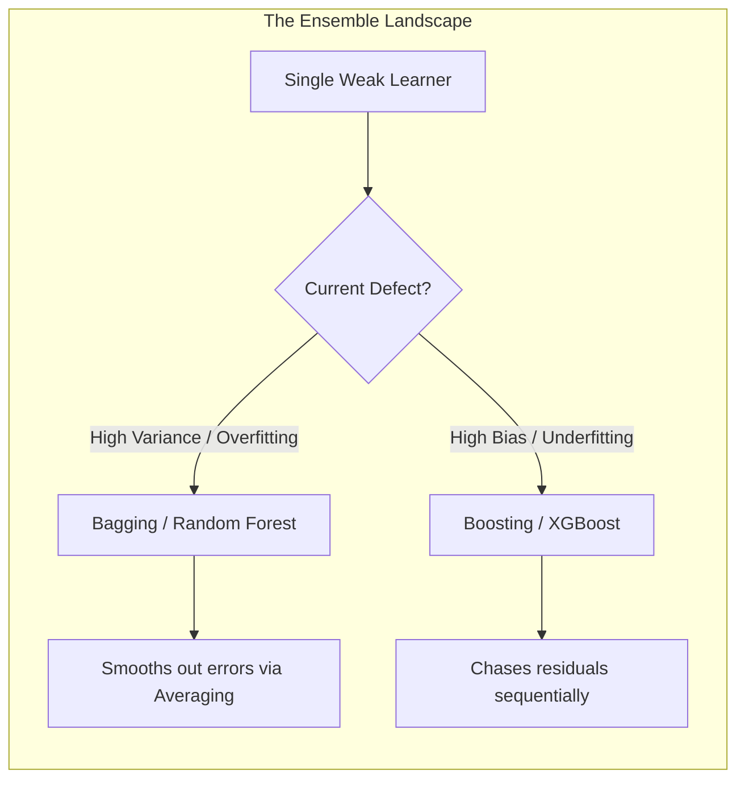

# Explanation: Why Ensembles Win

## Conceptual Overview
An **Ensemble Method** is a machine learning paradigm where multiple diverse, inferior models (often termed "weak learners") are strategically aggregated to synthesize a superior meta-model. 

In almost every modern structured data competition (like Kaggle), the winning architecture is an Ensemble. Single models (like a solo Decision Tree or a solo Linear line) effectively no longer exist at the bleeding edge of tabular predictive modeling.

## The Condorcet Jury Theorem
The mathematical foundation of Ensembles dates back to 1785. The Marquis de Condorcet hypothesized:

> If you have a jury of individuals, and each individual has a greater-than-50% chance of making the correct decision, adding more people to the jury mathematically drives the overall probability of a correct majority vote towards 100%.

If you build 100 Decision Trees, and each tree only has a 60% accuracy rate (barely better than a coin flip), but those trees are predicting completely independently of one another... taking the **Majority Vote** of all 100 trees will yield an accuracy pushing 90%+.

## The Two Frameworks: Bagging vs. Boosting

Ensembles must achieve **Diversity**. If you build 100 identical trees on the exact same data, they will all vote exactly the same way, erasing the mathematical advantage. Algorithms achieve diversity via two opposing architectures:

### 1. Bagging (Bootstrap Aggregation)
*Example: Random Forest*
- **Architecture:** Builds 100 deep, complex trees completely parallel to each other.
- **Diversity Mechanism:** Each tree receives a mathematically jumbled subset of the rows and columns.
- **Goal:** Deep trees have High Variance (they overfit wild noise). Bagging averages out the 100 different noisy lines, creating a smooth, generalized prediction. **Bagging destroys Variance.**

### 2. Boosting
*Example: XGBoost, GradientBoostingClassifier*
- **Architecture:** Builds 100 shallow, simplistic trees strictly in sequential order.
- **Diversity Mechanism:** Tree #2 is mathematically forced to look only at the rows that Tree #1 failed on. 
- **Goal:** Shallow trees have High Bias (they underfit and miss details). Boosting meticulously chains them together, reducing the bias step-by-step. **Boosting destroys Bias.**

## Connection to Practice
Stakeholders often complain that Ensembles are "Black Boxes"—they are incredibly accurate but mathematically impenetrable. You cannot easily explain *why* XGBoost made a specific prediction because the answer relies on 500 overlapping sequential trees.

In the L6 Assessment, if you choose an Ensemble, you must explicitly defend why the need for **Accuracy** outweighed the need for **Transparency** (which would have favored Logistic Regression). Explaining this tradeoff validates your business acumen.
