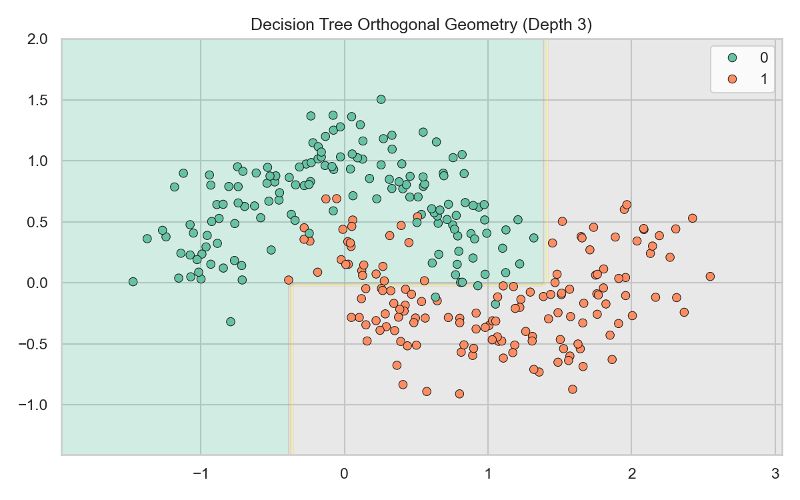

# Decision Trees

> Decision Trees bypass complex algebra entirely, opting to slice the feature space using simple orthogonal thresholds — like a game of "20 Questions".

## What You Will Learn

- Construct a `DecisionTreeClassifier` on synthetic data
- Understand how orthogonal splits differ from linear boundaries
- Restrict tree depth to prevent overfitting

## Step 1: Orthogonal Thresholds

Unlike `LogisticRegression` (which draws a single diagonal decision boundary), a Decision Tree makes a series of axis-aligned splits:

* Is `Feature X > 15`? → Yes / No
* If Yes, is `Feature Y < 3.2`? → Yes / No

Each split slices the feature space into rectangular regions. The tree keeps splitting until a stopping criterion is met.

## Step 2: Implementation

We use the `make_moons` synthetic dataset to demonstrate non-linear classification.

```python
import numpy as np
import matplotlib.pyplot as plt
import seaborn as sns
from sklearn.tree import DecisionTreeClassifier
from sklearn.datasets import make_moons
from sklearn.model_selection import train_test_split
from sklearn.metrics import accuracy_score

# 1. Generate non-linear synthetic data
X, y = make_moons(n_samples=300, noise=0.2, random_state=42)
X_train, X_test, y_train, y_test = train_test_split(X, y, random_state=42)

# 2. Train a depth-limited tree
dt = DecisionTreeClassifier(max_depth=3, random_state=42)
dt.fit(X_train, y_train)

preds = dt.predict(X_test)
print(f"Accuracy: {accuracy_score(y_test, preds):.2f}")
```

??? example "Expected Output"
    ```text
    Accuracy: 0.92
    ```

Now visualise the orthogonal decision boundaries:

```python
xx, yy = np.meshgrid(
    np.linspace(X[:, 0].min() - 0.5, X[:, 0].max() + 0.5, 100),
    np.linspace(X[:, 1].min() - 0.5, X[:, 1].max() + 0.5, 100)
)
Z = dt.predict(np.c_[xx.ravel(), yy.ravel()]).reshape(xx.shape)

plt.figure(figsize=(8, 5))
plt.contourf(xx, yy, Z, alpha=0.3, cmap="Set2")
sns.scatterplot(x=X[:, 0], y=X[:, 1], hue=y, palette="Set2", edgecolor="k")
plt.title("Decision Tree Boundaries (max_depth=3)")
plt.tight_layout()
plt.show()
```

??? example "Expected Plot"
    

Notice how all borders are perfectly horizontal or vertical — a single tree cannot draw curved or diagonal boundaries.

## Step 3: The Danger of Unlimited Depth (Overfitting)

If you do not set `max_depth`, the tree will keep growing until every training point has its own perfectly isolated region. It will score 100% on training data but fail catastrophically on unseen test data.

```python
# Unbound tree — will overfit
unbound = DecisionTreeClassifier(random_state=42)
unbound.fit(X_train, y_train)
print(f"Train: {unbound.score(X_train, y_train):.2f}")
print(f"Test:  {unbound.score(X_test, y_test):.2f}")
```

!!! tip "Workplace Tip"
    A standalone Decision Tree is rarely deployed to production due to its extreme variance. Instead, trees are used as building blocks inside ensemble methods like Random Forest and Gradient Boosting. Always set `max_depth` when using a single tree.

## KSB Mapping

| KSB | Description | How This Addresses It |
|-----|-------------|-----------------------|
| S13 | Apply ML algorithms | Implementing and constraining tree-based models |
