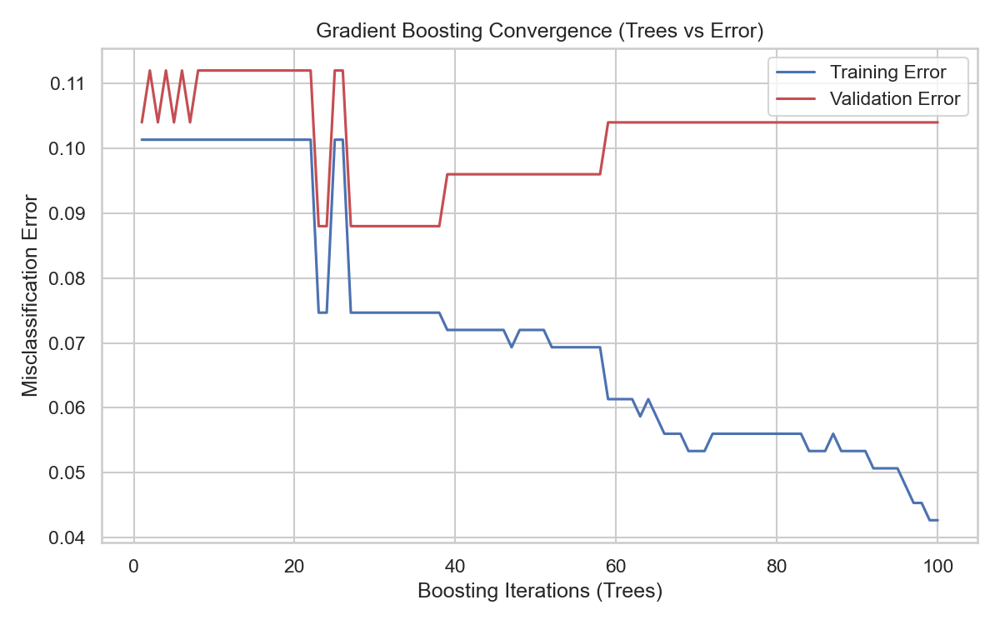

# Gradient Boosting

> While a Random Forest trains 100 independent trees simultaneously, Gradient Boosting trains 100 trees sequentially. Each new tree systematically attempts to correct the specific errors of the previous tree.

## What You Will Learn
- Differentiate Bagging (Random Forest) from Boosting
- Train a `GradientBoostingClassifier`
- Observe staged learning progression

## Prerequisites
- Completed the *Random Forests* module

## Step 1: The Intuition of Boosting

In **Random Forests**, if Tree #1 is completely wrong about Row 5, Tree #2 does not care. They train independently.

In **Gradient Boosting**, the algorithm trains sequentially:
1. **Tree 1** calculates a prediction for all rows. It registers a large error on Row 5.
2. **Tree 2** ignores the original target. Instead, Tree 2 spends 100% of its effort trying to predict the *error size* of Tree 1 on Row 5.
3. **Tree 3** inspects the combined error of Tree 1 + Tree 2, and focuses its splits on the remaining residuals.

## Step 2: Implementation

Scikit-Learn contains a built-in `GradientBoostingClassifier`.

```python
import numpy as np
import seaborn as sns
import matplotlib.pyplot as plt
from sklearn.ensemble import GradientBoostingClassifier
from sklearn.model_selection import train_test_split
from sklearn.datasets import make_moons
from sklearn.metrics import accuracy_score

# 1. Synthesize non-linear data
X, y = make_moons(n_samples=500, noise=0.3, random_state=42)
X_train, X_test, y_train, y_test = train_test_split(X, y, random_state=42)

# 2. Instantiate and train 
# learning_rate controls how aggressively each tree alters the pipeline.
gbc = GradientBoostingClassifier(n_estimators=100, learning_rate=0.1, max_depth=2, random_state=42)
gbc.fit(X_train, y_train)

preds = gbc.predict(X_test)
print(f"Algorithm Accuracy: {accuracy_score(y_test, preds):.2f}")
```

??? example "Expected Output"
    ```text
    Algorithm Accuracy: 0.88
    ```

## Step 3: Visualising Convergence 

Because Gradient Boosting corrects errors dynamically, we can chart the training loss decreasing steadily as more trees enter the pipeline.

```python
# Extract the staged pseudo-loss
train_loss = np.zeros(100)
test_loss = np.zeros(100)

for i, y_pred in enumerate(gbc.staged_predict_proba(X_train)):
    train_loss[i] = 1 - accuracy_score(y_train, np.argmax(y_pred, axis=1))
    
for i, y_pred in enumerate(gbc.staged_predict_proba(X_test)):
    test_loss[i] = 1 - accuracy_score(y_test, np.argmax(y_pred, axis=1))

plt.figure(figsize=(8, 5))
plt.plot(np.arange(100) + 1, train_loss, 'b-', label='Training Error')
plt.plot(np.arange(100) + 1, test_loss, 'r-', label='Validation Error')
plt.title('Gradient Boosting Convergence (Trees vs Error)')
plt.xlabel('Boosting Iterations (Trees)')
plt.ylabel('Misclassification Error')
plt.legend()
plt.tight_layout()
plt.show()
```

??? example "Expected Plot"
    

Unlike Random Forests, adding infinite trees to a Boosting algorithm will explicitly cause severe overfitting. You must strategically tune `n_estimators` using Early Stopping logic to halt training when `test_loss` begins increasing.

## KSB Mapping

| KSB | Description | How This Addresses It |
|-----|-------------|-------------------------------|
| K4.1 | Statistical models and methods | Understanding the statistical basis of regression and classification |
| K4.2 | ML and AI techniques | Implementing and comparing supervised learning algorithms |
| K4.4 | Resource constraints and trade-offs | Model complexity vs interpretability; computational cost |
| S1 | Scientific methods and hypothesis testing | Formulating hypotheses and testing with rigorous validation |
| S4 | Building models and validating | Cross-validation, train/test evaluation, performance metrics |
| B5 | Impartial, hypothesis-driven approach | Honest evaluation of model performance and limitations |
