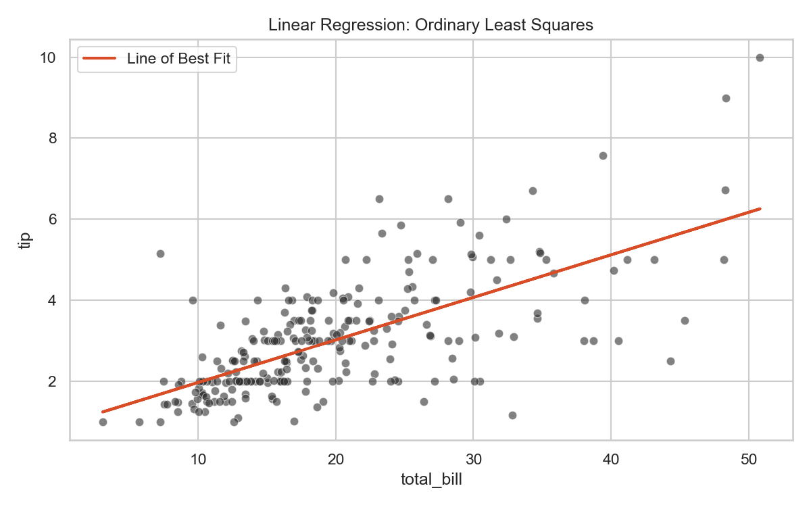

# Linear Regression

> The foundation of predictive calculus. Linear regression simply draws the straightest possible line through a geometric scatter plot of continuous numbers.

## What You Will Learn
- Define Ordinary Least Squares (OLS) conceptually
- Fit a baseline `LinearRegression` model using Scikit-Learn
- Interpret Mean Squared Error (MSE) and R-Squared ($R^2$) computationally

## Prerequisites
- Completed Topic 1 (Data Preparation)
- Understanding of continuous numerical features (Floats)

## Step 1: The Intuition (Ordinary Least Squares)

If you have a dataset mapping `total_bill` to `tip`, a Linear Regression attempts to draw a straight trajectory through the exact center of all data points simultaneously.

It mathematically achieves this by minimizing the "Residuals" (the absolute physical distance separating each true data dot from the imaginary straight line). This explicit optimization computationally is titled "Ordinary Least Squares" (OLS).

## Step 2: Training the Algorithm

We will train a Scikit-Learn `LinearRegression` algorithm securely utilizing the Seaborn `tips` dataset.

```python
import pandas as pd
import seaborn as sns
from sklearn.linear_model import LinearRegression
from sklearn.model_selection import train_test_split
from sklearn.metrics import root_mean_squared_error, r2_score

df = sns.load_dataset('tips')

# 1. Define independent (X) and dependent (y) variables
X = df[['total_bill']] # X must be a 2D Array/DataFrame
y = df['tip']

# 2. Defensively quarantine the testing arrays
X_train, X_test, y_train, y_test = train_test_split(X, y, test_size=0.2, random_state=42)

# 3. Instantiate and train 
model = LinearRegression()
model.fit(X_train, y_train)

# 4. Generate blind predictions against the quarantined vault
predictions = model.predict(X_test)

print(f"First 5 Predictions: {predictions[:5].round(2)}")
```

??? example "Expected Output"
    ```text
    First 5 Predictions: [2.86 5.09 1.95 3.03 2.5 ]
    ```

Let's structurally plot the explicit mathematical Line of Best Fit:

```python
import matplotlib.pyplot as plt

plt.figure(figsize=(8, 5))
sns.scatterplot(data=df, x='total_bill', y='tip', alpha=0.6, color='#2D2D2D')
plt.plot(X, model.predict(X), color='#D94D26', linewidth=2, label='Line of Best Fit')
plt.title('Linear Regression: Ordinary Least Squares')
plt.legend()
plt.tight_layout()
plt.show()
```

??? example "Expected Plot"
    

## Step 3: Analytical Evaluation

How "good" conceptually is the straight mathematical line objectively? We structurally utilize two quantitative mathematical scoring algorithms:

1. **RMSE (Root Mean Squared Error):** The mathematical absolute average geographic distance separating your explicit line from the true data natively. (Lower is better).
2. **$R^2$ (R-Squared):** The physical percentage conceptually describing how much variance natively belonging to `tip` is identically explained mathematically utilizing ONLY the variance natively residing securely inside `total_bill` effectively. (Max is 1.0).

```python
# Compute mathematical structural scores functionally natively
rmse = root_mean_squared_error(y_test, predictions)
r2 = r2_score(y_test, predictions)

print(f"RMSE: ${rmse:.2f}")
print(f"R-Squared: {r2:.2f}")
```

??? example "Expected Output"
    ```text
    RMSE: $0.85
    R-Squared: 0.42
    ```

Our simple model miscalculates explicit tips mathematically by `£0.85` inherently! Furthermore, exactly `42%` of a tip's entire size computationally derives logically from the bill's physical dimension.

!!! tip "Workplace Tip"
    Never confidently deploy a Linear Regression objectively natively without mapping logically the visual exact residual explicitly. If the residuals (errors) form a curved shape rather than random static noise, your relationship is actually non-linear, and the OLS regression has functionally failed.

## KSB Mapping

| KSB | Description | How This Tutorial Addresses It |
|-----|-------------|-------------------------------|
| S13 | Apply ML algorithms | Deploying strictly linear computational topologies |
| K5 | Machine Learning workflows | Computing explicitly formal test-set objective metrics |
