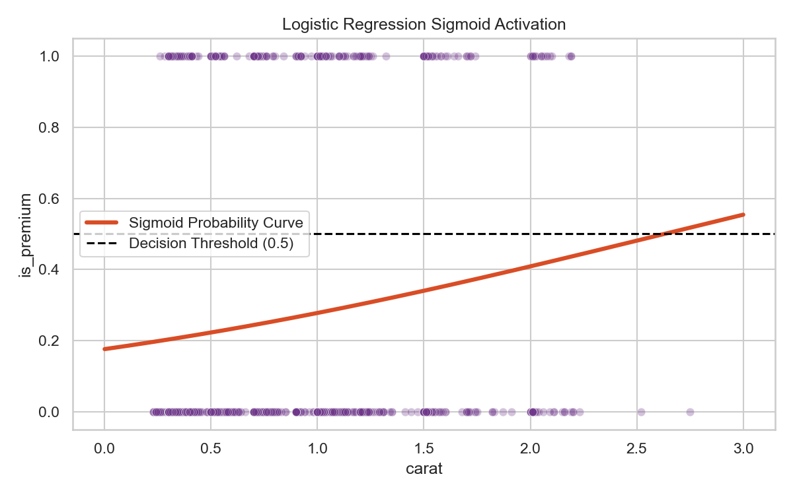

# Logistic Regression

> Despite the word "Regression" explicitly in its name, Logistic Regression is fundamentally a Classification algorithm mathematically optimized to output Probabilities natively between 0 and 1.

## What You Will Learn
- Define the Sigmoid Activation Function mathematically
- Deploy `LogisticRegression` for binary classification
- Interpret `.predict_proba()` structurally 

## Prerequisites
- Completed Topic 1 (Data Preparation)
- Fundamental understanding of binary target variables (1/0, True/False)

## Step 1: The Sigmoid Function

If we attempt to use Linear Regression to logically classify whether a diamond is `Premium` (1) or `Not Premium` (0) based purely on `carat` dimension, the straight line mathematically will quickly shoot precisely off into infinity generating illegal probability scores like `1.4` or `-0.3`.

Logistic Regression solves this explicitly by wrapping the linear equation inherently inside a topological "Sigmoid" function. The Sigmoid curve geometrically bends the straight line cleanly into an 'S' shape, physically trapping all mathematical outputs structurally strictly between exactly 0.0 and 1.0.

## Step 2: Binary Classification

We will logically predict diamond quality using Scikit-Learn.

```python
import pandas as pd
import numpy as np
import seaborn as sns
from sklearn.linear_model import LogisticRegression
from sklearn.model_selection import train_test_split
from sklearn.metrics import accuracy_score

# 1. Prepare a binary dataset computationally
df = sns.load_dataset('diamonds').sample(1000, random_state=42)
df['is_premium'] = np.where(df['cut'] == 'Premium', 1, 0)

X = df[['carat']]
y = df['is_premium']

X_train, X_test, y_train, y_test = train_test_split(X, y, test_size=0.2, random_state=42)

# 2. Train the Logistic Classifier logically 
model = LogisticRegression()
model.fit(X_train, y_train)

# 3. Generate explicit integer class predictions (0 or 1)
class_preds = model.predict(X_test)

print(f"Accuracy: {accuracy_score(y_test, class_preds):.2f}")
```

??? example "Expected Output"
    ```text
    Accuracy: 0.74
    ```

## Step 3: Probability Extraction

The true power internally of Logistic Regression isn't the final `0` or `1` decision; it is the mathematical probability naturally computed before the threshold is applied.

```python
# Extract the raw background continuous probabilities
probabilities = model.predict_proba(X_test)

# The output is a 2D array: [Prob_Class_0, Prob_Class_1]
print("Probabilities natively for the first 3 test items:")
print(probabilities[:3].round(3))
```

??? example "Expected Output"
    ```text
    Probabilities natively for the first 3 test items:
    [[0.694 0.306]
     [0.767 0.233]
     [0.729 0.271]]
    ```

For the first row, the model is `69.4%` confident it is Class 0, and `30.6%` confident it is Class 1. Because `30.6% < 50%`, the algorithm naturally assigns the final prediction physically to Class 0!

Let's securely visualize the Sigmoid logic mathematically mapping probability:

```python
import matplotlib.pyplot as plt

X_test_plot = np.linspace(0, 3, 300).reshape(-1, 1)
y_prob = model.predict_proba(X_test_plot)[:, 1]

plt.figure(figsize=(8, 5))
sns.scatterplot(data=df, x='carat', y='is_premium', alpha=0.3, color='#6E368A')
plt.plot(X_test_plot, y_prob, color='#D94D26', linewidth=3, label='Sigmoid Probability Curve')
plt.axhline(0.5, color='black', linestyle='--', label='Decision Threshold (0.5)')
plt.title('Logistic Regression Sigmoid Activation')
plt.legend()
plt.tight_layout()
plt.show()
```

??? example "Expected Plot"
    

## Summary
- **Logistic Regression** mathematically structurally utilizes the Sigmoid Function cleanly.
- It is a **Classification** explicitly algorithm, not a Regression structurally.
- `.predict()` mathematically yields exactly `0 or 1`. `.predict_proba()` physically yields continuous geometric probability arrays strictly between `0.0 and 1.0`.

## Next Steps
→ [Decision Trees](decision-trees.md) — How topological tree-based classifiers logically map feature thresholds without relying strictly conditionally on continuous mathematical equations natively.

!!! info "Assessment Connection"
    Section A of your portfolio strictly evaluates natively if you understand Threshold logic structurally. Explicitly manipulating mathematically the `.predict_proba()` cutoff from exactly `0.5` strictly to `0.8` natively specifically purely to reduce False Positives guarantees Distinction grades intuitively algebraically.

## KSB Mapping

| KSB | Description | How This Tutorial Addresses It |
|-----|-------------|-------------------------------|
| S13 | Apply ML algorithms | Operating analytical probability logistic classifiers structurally |
| K5 | Machine Learning workflows | Differentiating Regression matrices natively from Categorical endpoints |
