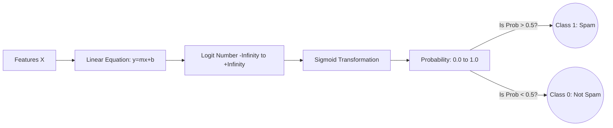

# Logistic Regression for Classification

> "Despite its confusing name, Logistic Regression is the industry standard for Binary Classification, not Regression."

## What You Will Learn

- Understand the Sigmoid function mapping logic
- Train a `LogisticRegression` model for binary classification
- Interpret probabilistic thresholds

## Prerequisites

- [Linear Regression under the Hood](linear-regression.md)

## Step 1: The Problem with Linear Lines

If you want to predict whether an email is "Spam" (1) or "Not Spam" (0) based on the number of typos:

If you use a standard straight line (Linear Regression), the line will eventually predict values like `y = -1.5` or `y = 3.2`. These numbers are meaningless when you are strictly trying to classify into `0` or `1`.

We solve this by wrapping the linear equation inside a **Sigmoid Activation Function**, which mathematically crushes any number between $-\infty$ and $+\infty$ into a strict boundary between `[0, 1]`.

\\[
P_r(y=1 | x) = \frac{1}{1 + e^{-(\beta_0 + \beta_1x)}}
\\]



## Step 2: Implementation

```python
import pandas as pd
import numpy as np
import matplotlib.pyplot as plt
import seaborn as sns
from sklearn.linear_model import LogisticRegression
from sklearn.datasets import make_classification
from sklearn.model_selection import train_test_split
from sklearn.metrics import accuracy_score, confusion_matrix

# Generate 500 fake samples. Target is binary (0 or 1).
X, y = make_classification(n_samples=500, n_features=2, n_redundant=0, 
                           n_informative=2, random_state=42, n_clusters_per_class=1)

X_train, X_test, y_train, y_test = train_test_split(X, y, test_size=0.2, random_state=42)

# 1. Instantiate Model
# Logistic Regression automatically includes L2 (Ridge) Penalty!
clf = LogisticRegression()

# 2. Fit Model
clf.fit(X_train, y_train)

# 3. Predict Classes (Outputs strict 0s and 1s based on 0.5 default threshold)
predictions = clf.predict(X_test)
print(f"Accuracy: {accuracy_score(y_test, predictions):.2f}")

# Plot Decision Boundary (Visualizing the separation)
plt.figure(figsize=(10, 6))
# Create a tight meshgrid of points covering the span
xx, yy = np.meshgrid(np.linspace(X[:,0].min()-1, X[:,0].max()+1, 100),
                     np.linspace(X[:,1].min()-1, X[:,1].max()+1, 100))

# Predict the probability of every point in the grid
Z = clf.predict(np.c_[xx.ravel(), yy.ravel()]).reshape(xx.shape)

plt.contourf(xx, yy, Z, alpha=0.3, cmap='bwr')
sns.scatterplot(x=X_test[:, 0], y=X_test[:, 1], hue=y_test, palette='bwr', edgecolor='k')
plt.title('Logistic Regression Decision Boundary')
plt.show()
```

## Step 3: Probabilities over Classes

In business, a hard `0` or `1` is often less useful than the underlying certainty. If a model predicts a transaction is Fraud (1), we want to know if it is 51% certain or 99% certain.

```python
# Extract the underlying probabilities
probs = clf.predict_proba(X_test)

# Show the first 5 test cases
print("\\nProbabilities [Class 0, Class 1]:")
for i in range(5):
    print(f"Case {i}: {probs[i][0]:.3f} vs {probs[i][1]:.3f}  -->  Predicted: {predictions[i]}")
```

!!! tip "Workplace Tip"
    You can manually shift the classification threshold. In a medical diagnostic system, you don't wait for 50% probability to warn a doctor. You might raise an alert if probability $> 0.15$. Changing the threshold manipulates the **Precision-Recall Tradeoff**.

## Summary

`LogisticRegression` provides the exact interpretability of Linear models but applied cleanly to categorical targets. By converting linear outputs into functional probability distributions, it empowers data scientists to construct highly configurable classification engines.

## Next Steps

→ [Support Vector Machines (SVM)](support-vector-machines.md)

## KSB Mapping

| KSB | Description | How This Tutorial Addresses It |
|-----|-------------|-------------------------------|
| S2 | Apply machine learning | Implements probability engines via Sigmoid |
| K1 | Mathematical Principles | Explains the thresholding equation mapping |
