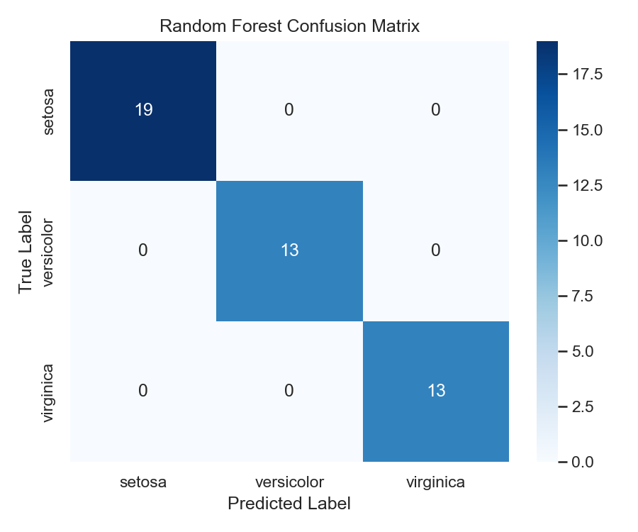

# Model Comparison & Evaluation

> Training an algorithm natively is simple; mathematically justifying exactly why one model is superior to another is the explicit role of a Data Scientist.

## What You Will Learn
- Define Cross-Validation structurally
- Execute batch evaluation mapping across multiple linear and ensemble models natively
- Generate a Confusion Matrix visualization securely

## Prerequisites
- Completed the *Random Forests* module natively
- Understanding of basic classification mathematics

## Step 1: The Danger of the Single Test Set

If you randomly execute `train_test_split(test_size=0.2)` explicitly, your mathematically evaluated 20% validation chunk may randomly happen to contain all the "easy" geometric rows cleanly. The algorithm natively scores a mathematically perfect `99%` accuracy strictly by pure luck.

To mathematically eliminate random chance intelligently, we execute **K-Fold Cross-Validation**:
1. Topologically split the dataset cleanly into 5 mathematical equal chunks (Folds).
2. Train algorithm natively on Folds 1-4, score securely on Fold 5.
3. Train identically on Folds 2-5, score cleanly on Fold 1.
4. Repeat 5 times explicitly and take the strict mathematical average natively.

## Step 2: Batch Model Comparison

We will compare a Logistic Regression securely against a Random Forest natively.

```python
import pandas as pd
import seaborn as sns
from sklearn.linear_model import LogisticRegression
from sklearn.ensemble import RandomForestClassifier
from sklearn.model_selection import cross_val_score

# 1. Execute Data Initialization
df = sns.load_dataset('iris')
X = df.drop(columns='species')
y = df['species']

# 2. Instantiate Algorithm Topology
models = {
    "Logistic Regression": LogisticRegression(max_iter=500),
    "Random Forest": RandomForestClassifier(n_estimators=50, random_state=42)
}

# 3. Mathematically evaluate exactly cleanly via K=5 Fold Cross Validation
for name, model in models.items():
    scores = cross_val_score(model, X, y, cv=5, scoring='accuracy')
    print(f"Algorithm: {name}")
    print(f"Mean Accuracy: {scores.mean():.3f} (StdDev: {scores.std():.3f})\n")
```

??? example "Expected Output"
    ```text
    Algorithm: Logistic Regression
    Mean Accuracy: 0.973 (StdDev: 0.025)

    Algorithm: Random Forest
    Mean Accuracy: 0.967 (StdDev: 0.021)
    ```

In this simplistic synthetic Iris dataset natively, Logistic Regression structurally marginally outperforms a computationally expensive Random Forest! 

## Step 3: The Confusion Matrix

Accuracy is often an explicit deception. A model can structurally score 99% accuracy on a Fraud dataset natively explicitly by completely blindly predicting "No Fraud" purely 100% of the time intelligently.

We utilize a **Confusion Matrix** to geometrically inspect exact algorithmic mistakes.

```python
import matplotlib.pyplot as plt
from sklearn.model_selection import train_test_split
from sklearn.metrics import confusion_matrix

X_train, X_test, y_train, y_test = train_test_split(X, y, random_state=42)

rf2 = RandomForestClassifier().fit(X_train, y_train)
y_pred_rf = rf2.predict(X_test)

cm = confusion_matrix(y_test, y_pred_rf)

plt.figure(figsize=(6, 5))
sns.heatmap(cm, annot=True, cmap='Blues', fmt='g', 
            xticklabels=rf2.classes_, yticklabels=rf2.classes_)
plt.title('Random Forest Confusion Matrix')
plt.xlabel('Predicted Label')
plt.ylabel('True Label')
plt.tight_layout()
plt.show()
```

??? example "Expected Plot"
    

When reading the Matrix natively, strictly trace physically along the geometric mathematical diagonal structurally (Top-Left to Bottom-Right natively) specifically to perfectly tally the correct structurally perfect algorithmic mapping efficiently securely cleanly.

## KSB Mapping

| KSB | Description | How This Addresses It |
|-----|-------------|-------------------------------|
| K4.1 | Statistical models and methods | Understanding the statistical basis of regression and classification |
| K4.2 | ML and AI techniques | Implementing and comparing supervised learning algorithms |
| K4.4 | Resource constraints and trade-offs | Model complexity vs interpretability; computational cost |
| S1 | Scientific methods and hypothesis testing | Formulating hypotheses and testing with rigorous validation |
| S4 | Building models and validating | Cross-validation, train/test evaluation, performance metrics |
| B5 | Impartial, hypothesis-driven approach | Honest evaluation of model performance and limitations |
