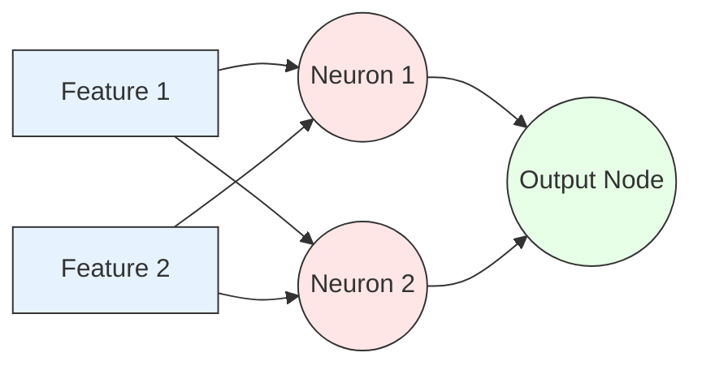

# Neural Networks (Multilayer Perceptrons)

> "A Neural Network is just a logistical chain of simple linear regressions, folded together using non-linear math, capable of mapping the universe."

## What You Will Learn

- Understand the architecture of a Feed-Forward Multilayer Perceptron (MLP)
- Define Activation Functions (ReLU, Sigmoid)
- Train an `MLPClassifier` using Scikit-Learn

## Prerequisites

- [Scaling & Normalisation](../../topic-1-data-preparation/tutorials/scaling-normalisation.md)
- [Logistic Regression for Classification](logistic-regression.md)

## Step 1: The Architecture

A Neural Network is composed of "Neurons" (Nodes) arranged in vertical columns called "Layers".

1. **Input Layer:** Directly receives the scaled feature columns.
2. **Hidden Layer(s):** The magical processing zone. Each neuron here receives signals from *every* neuron in the previous layer. It multiplies those signals by a "weight", adds them up, applies an Activation Function, and passes the result forward.
3. **Output Layer:** The final prediction. For binary classification, this is a single neuron outputting a probability using the Sigmoid function.



### The Activation Function Breakdown

If we only multiply weights, a network of 10,000 neurons reduces mathematically to a single, boring straight line ($y=mx+b$). 

We must inject curved logic using **Activation Functions** at each node:
- **ReLU (Rectified Linear Unit):** `If x < 0, output 0. Else output x.` This simple curve is the primary engine behind modern Deep Learning.
- **Sigmoid:** Squashes the final summation into a strict probability between 0 and 1. 

## Step 2: Implementation

> [!CAUTION]
> Neural Networks utilize **Gradient Descent Optimization**. If you do not scale your inputs via `StandardScaler`, the gradients will instantly explode, and the model will fail to learn.

```python
import pandas as pd
from sklearn.datasets import make_moons
from sklearn.model_selection import train_test_split
from sklearn.preprocessing import StandardScaler
from sklearn.neural_network import MLPClassifier
from sklearn.metrics import accuracy_score

# Make nonlinear 'moon' shaped data
X, y = make_moons(n_samples=500, noise=0.2, random_state=42)
X_train, X_test, y_train, y_test = train_test_split(X, y, test_size=0.2)

# SCALING IS MANDATORY
scaler = StandardScaler()
X_train_scaled = scaler.fit_transform(X_train)
X_test_scaled = scaler.transform(X_test)

# 1. Architecture Design
# hidden_layer_sizes=(10, 5) means: 
# Layer 1 has 10 Neurons. Layer 2 has 5 Neurons.
mlp = MLPClassifier(
    hidden_layer_sizes=(10, 5), 
    activation='relu',      # Non-linear injection
    solver='adam',          # The Gradient Descent engine
    max_iter=1000,          # Epochs (how many times it views data)
    random_state=42
)

# 2. Train Network
mlp.fit(X_train_scaled, y_train)

# 3. Evaluate
predictions = mlp.predict(X_test_scaled)
print(f"MLP Network Accuracy: {accuracy_score(y_test, predictions):.4f}")
```

## Summary

Scikit-Learn's `MLPClassifier` is an excellent introduction to neural topographies. However, for massive industry deployments involving images (CNNs) or text (Transformers), Data Scientists shift away from Scikit-Learn toward explicit graphing libraries like **PyTorch** or **TensorFlow**.

## Next Steps

Explore the How-To guides to understand how to apply and troubleshoot these predictive algorithms in production.

## KSB Mapping

| KSB | Description | How This Tutorial Addresses It |
|-----|-------------|-------------------------------|
| S2 | Apply machine learning algorithms | Implements MLP architectures |
| K2 | ML Paradigms | Distinguishes between tabular algorithms and deep architectures |
