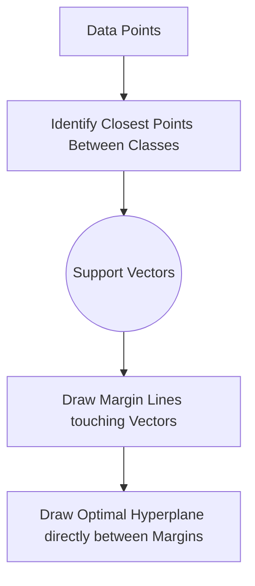

# Support Vector Machines (SVM)

> "If the data isn't separable in this dimension, simply fold space until it is." 

## What You Will Learn

- Understand the concept of the Optimal Hyperplane and Support Vectors
- Identify the mathematical definition of the Maximum Margin
- Utilize the Kernel Trick (RBF) to solve non-linear classifications

## Prerequisites

- [Logistic Regression for Classification](logistic-regression.md)
- [Scaling & Normalisation](../../topic-1-data-preparation/tutorials/scaling-normalisation.md)

## Step 1: The Maximum Margin

Logistic Regression draws a boundary (hyperplane) that separates classes. However, there are infinitely many lines that can separate two clusters of points. Logistic Regression will stop calculating as soon as it finds *any* line that results in low error.

**Support Vector Machines** are structurally different. They don't just find *any* line; they find the **Optimal Hyperplane**. This is the specific line that maximizes the physical distance (the Margin) between itself and the closest data points of both classes.

Those closest, critical data points that dictate the margin's width are called the **Support Vectors**. If you delete every other point in the dataset except the Support Vectors, the SVM will still draw the exact same boundary.



## Step 2: Implementation (Linear Kernel)

> [!CAUTION]
> SVMs rely entirely on physical geometry and calculating distances. Therefore, **you must scale your data** before deploying an SVM, otherwise, features with massive numeric ranges will dictate the margin.

```python
import pandas as pd
import numpy as np
import matplotlib.pyplot as plt
from sklearn.svm import SVC # Support Vector Classifier
from sklearn.datasets import make_blobs
from sklearn.model_selection import train_test_split
from sklearn.preprocessing import StandardScaler
from sklearn.metrics import classification_report

# Generate perfectly separable clusters
X, y = make_blobs(n_samples=100, centers=2, random_state=42, cluster_std=1.2)
X_train, X_test, y_train, y_test = train_test_split(X, y, test_size=0.2)

# MANDATORY: Scale Data
scaler = StandardScaler()
X_train_scaled = scaler.fit_transform(X_train)
X_test_scaled = scaler.transform(X_test)

# 1. Instantiate the SVM with a Linear boundary
svm = SVC(kernel='linear', C=1.0) # C controls the hardness of the margin

# 2. Fit the Model
svm.fit(X_train_scaled, y_train)

print(classification_report(y_test, svm.predict(X_test_scaled)))
```

### The $C$ Hyperparameter (Regularisation)

In reality, data overlaps. You cannot draw a perfect line.
- **Low $C$:** A "Soft" margin. The SVM allows some points to cross the boundary if it creates a wider, more generalized gap overall (Low Variance, High Bias).
- **High $C$:** A "Hard" margin. The SVM will bend aggressively to ensure zero training points are misclassified, resulting in a tiny, highly specialized margin (High Variance, Low Bias).

## Step 3: The Kernel Trick (Non-Linear Data)

If your data is shaped like a circle inside a ring, no straight line ($1D$) or flat pane ($2D$) can separate them. 

The **Kernel Trick** is a mathematical shortcut that physically projects the flat data into a higher dimension (like stretching a 2D sheet of rubber into a 3D bowl shape) where a flat pane *can* successfully slice them apart.

```python
from sklearn.datasets import make_circles

# Generate non-linear circular data
X_circ, y_circ = make_circles(n_samples=200, factor=0.3, noise=0.1, random_state=42)

scaler_circ = StandardScaler()
X_circ_scaled = scaler_circ.fit_transform(X_circ)

# Define the SVM using Radial Basis Function (RBF)
svm_rbf = SVC(kernel='rbf', C=1.0, gamma='scale')
svm_rbf.fit(X_circ_scaled, y_circ)

# Visualizing the RBF Kernel cutting through the circles
# Create meshgrid
xx, yy = np.meshgrid(np.linspace(-3, 3, 100), np.linspace(-3, 3, 100))
Z = svm_rbf.decision_function(np.c_[xx.ravel(), yy.ravel()]).reshape(xx.shape)

plt.figure(figsize=(8,6))
plt.contourf(xx, yy, Z, levels=[Z.min(), 0, Z.max()], alpha=0.3, cmap='coolwarm')
plt.scatter(X_circ_scaled[:, 0], X_circ_scaled[:, 1], c=y_circ, edgecolors='k', cmap='coolwarm')
plt.title('SVM Decision Boundary (RBF Kernel)')
plt.show()
```

## Summary

SVMs are devastatingly accurate, particularly on smaller, complex datasets ($N < 10,000$). However, because they scale cubically $O(n^3)$ with the number of samples, they will mathematically freeze your computer if you attempt to train them on millions of customer records.

## Next Steps

→ [Decision Trees & Random Forests](decision-trees.md)

## KSB Mapping

| KSB | Description | How This Tutorial Addresses It |
|-----|-------------|-------------------------------|
| S2 | Apply machine learning algorithms | Implements the SVM classifier conceptually and programmatically |
| K2 | ML Algorithms | Visualizes the complex spatial geometry of Kernels |
