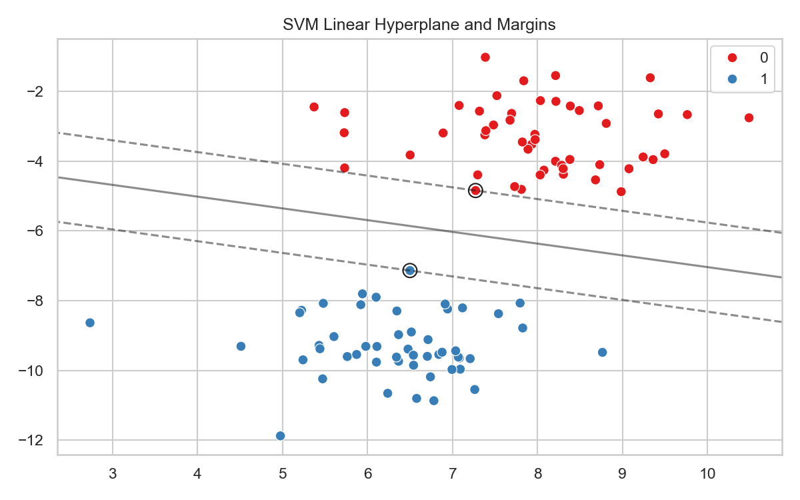

# Support Vector Machines (SVM)

> A Support Vector Machine (SVM) does not just try to draw a dividing line. It tries to draw the widest possible "street" separating two classes of data.

## What You Will Learn
- Define the Maximum Margin Hyperplane conceptually
- Deploy a linear `SVC` using Scikit-Learn
- Differentiate between Hard and Soft Margins

## Prerequisites
- Completed Topic 1 (Data Preparation)
- Understanding of binary classification logic

## Step 1: The Maximum Margin Hyperplane

If you want to separate cats from dogs using their weight and height, there are infinite lines you could mathematically draw between them. 

Logistic Regression simply finds *a* line that separates the classes. Support Vector Machines find the *optimal* line. The optimal line is the one that stays as far away as possible from the closest points in each class. 

The closest data points that the margin "leans" against are called the **Support Vectors**. 

## Step 2: Implementation

We will use Scikit-Learn to build an SVM model on synthetic blob data.

```python
import pandas as pd
import numpy as np
import seaborn as sns
from sklearn.svm import SVC
from sklearn.datasets import make_blobs

# 1. Synthesize two distinct clusters
X, y = make_blobs(n_samples=100, centers=2, random_state=6)

# 2. Instantiate and train a Linear SVM
# The "C" parameter controls the margin width. A high C makes a strict, narrow margin.
svm = SVC(kernel='linear', C=1000)
svm.fit(X, y)

print(f"Number of Support Vectors explicitly driving the model: {len(svm.support_vectors_)}")
```

??? example "Expected Output"
    ```text
    Number of Support Vectors explicitly driving the model: 3
    ```

In this model, out of 100 data points, exactly 3 data points (the Support Vectors) are structurally dictating the exact angle and position of the boundary. The other 97 points are ignored. This makes SVMs mathematically highly memory efficient.

Let's structurally plot the margin boundary:

```python
import matplotlib.pyplot as plt

plt.figure(figsize=(8, 5))
sns.scatterplot(x=X[:, 0], y=X[:, 1], hue=y, palette='Set1', s=50)

# Extract plot limits
ax = plt.gca()
xlim = ax.get_xlim()
ylim = ax.get_ylim()

# Create meshgrid to evaluate model
xx, yy = np.meshgrid(np.linspace(xlim[0], xlim[1], 50),
                     np.linspace(ylim[0], ylim[1], 50))
Z = svm.decision_function(np.c_[xx.ravel(), yy.ravel()]).reshape(xx.shape)

# Plot decision boundary and margins
ax.contour(xx, yy, Z, colors='k', levels=[-1, 0, 1], alpha=0.5, linestyles=['--', '-', '--'])

# Circle the Support Vectors
ax.scatter(svm.support_vectors_[:, 0], svm.support_vectors_[:, 1], 
           s=100, linewidth=1, facecolors='none', edgecolors='k')

plt.title('SVM Linear Hyperplane and Margins')
plt.tight_layout()
plt.show()
```

??? example "Expected Plot"
    

## Step 3: Standardisation is Mandatory

Because SVM attempts to calculate physical geometric Euclidean distance (the margin width), it is extremely sensitive to scale.

If Feature 1 is measured in Millimetres (0-10) and Feature 2 is measured in Kilometres (0-1000), the SVM will mathematically ignore Feature 1 entirely.

**You must always run `StandardScaler` or `MinMaxScaler` prior to executing an SVM.**

!!! tip "Workplace Tip"
    The `C` parameter dictates "Soft Margin" execution. If you have messy data with overlapping classes, a strict mathematical line (High `C`) will overfit wildly. Set `C` to a small decimal (e.g. `C=0.1`) to instruct the algorithm to actively allow a few misclassifications inside the boundary to secure a broader, more realistic "street".

## KSB Mapping

| KSB | Description | How This Addresses It |
|-----|-------------|-------------------------------|
| K4.1 | Statistical models and methods | Understanding the statistical basis of regression and classification |
| K4.2 | ML and AI techniques | Implementing and comparing supervised learning algorithms |
| K4.4 | Resource constraints and trade-offs | Model complexity vs interpretability; computational cost |
| S1 | Scientific methods and hypothesis testing | Formulating hypotheses and testing with rigorous validation |
| S4 | Building models and validating | Cross-validation, train/test evaluation, performance metrics |
| B5 | Impartial, hypothesis-driven approach | Honest evaluation of model performance and limitations |
