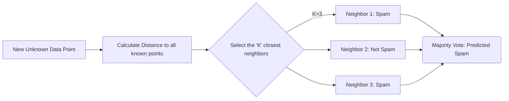

# K-Nearest Neighbors (KNN)

> "Show me who your friends are, and I'll tell you who you are." 

## What You Will Learn

- Understand spatial distance algorithms (Euclidean & Manhattan)
- Implement `KNeighborsClassifier` and `KNeighborsRegressor`
- Tune the `n_neighbors` ($K$) parameter to balance the Bias/Variance tradeoff

## Prerequisites

- [Scaling & Normalisation](../../topic-1-data-preparation/tutorials/scaling-normalisation.md)

## Step 1: The Geometry of Similarity

Linear Regression and SVMs are **Parametric** models—they calculate an algebraic formula ($\beta_0 + \beta_1x$) to draw a rigid boundary line through data.

K-Nearest Neighbors is a **Non-Parametric** model. It has absolutely no algebraic formula. It does not draw boundaries during training. In fact, KNN *does not train at all*. It simply memorizes the entire dataset.

When asked to predict a new data point, it mathematical calculates the physical distance from that new point to *every single other point in the database*, finds the $K$ closest neighbors, and takes a democratic vote.

\\[
Euclidean\\ Distance = \\sqrt{\\sum_{i=1}^{n} (x_i - y_i)^2}
\\]



## Step 2: Implementation

> [!CAUTION]
> Because KNN relies entirely on physical distance algorithms (like the Pythagorean theorem), **you must scale your data** before deploying KNN, otherwise features with massive numeric ranges will dictate the distance calculation.

```python
import pandas as pd
import numpy as np
from sklearn.datasets import load_iris
from sklearn.model_selection import train_test_split
from sklearn.preprocessing import StandardScaler
from sklearn.neighbors import KNeighborsClassifier
from sklearn.metrics import classification_report

# Load Data
iris = load_iris()
X, y = iris.data, iris.target

X_train, X_test, y_train, y_test = train_test_split(X, y, test_size=0.2, random_state=42)

# MANDATORY: Scale Data
scaler = StandardScaler()
X_train_scaled = scaler.fit_transform(X_train)
X_test_scaled = scaler.transform(X_test)

# 1. Instantiate the Model (K=5)
knn = KNeighborsClassifier(n_neighbors=5, metric='euclidean')

# 2. Fit the Model (This takes 0 seconds, it just memorizes the array)
knn.fit(X_train_scaled, y_train)

# 3. Predict (This takes much longer, as it must calculate distance to all training points)
print(classification_report(y_test, knn.predict(X_test_scaled)))
```

## Step 3: Tuning $K$

The choice of $K$ dictates the Bias/Variance tradeoff.
- If **$K=1$**: The model perfectly memorizes the training data (Massive Variance, Overfitting). It is hypersensitive to noisy outliers.
- If **$K=$ Total Population**: The model simply predicts the most globally frequent class every single time (Massive Bias, Underfitting).

```python
import matplotlib.pyplot as plt

# Finding the optimal K mathematically
accuracies = []
k_range = range(1, 25)

for k in k_range:
    temp_knn = KNeighborsClassifier(n_neighbors=k)
    temp_knn.fit(X_train_scaled, y_train)
    accuracies.append(temp_knn.score(X_test_scaled, y_test))

plt.figure(figsize=(10, 6))
plt.plot(k_range, accuracies, marker='o', linestyle='dashed')
plt.title('Elbow Curve: Accuracy vs. K Value')
plt.xlabel('Number of Neighbors (K)')
plt.ylabel('Testing Accuracy')
plt.xticks(k_range)
plt.grid(True)
plt.show()
```

## Summary

KNN is often called a "Lazy Learner" because it defers all computation until the moment of prediction. 

It is incredibly powerful for small, complex datasets where mathematical boundaries fail. However, if deployed on a database of 10 Million users, predicting a single new user requires 10 Million distance calculations across every feature column—a computationally devastating requirement for live API servers.

## Next Steps

→ [Naive Bayes Classifiers](naive-bayes.md)

## KSB Mapping

| KSB | Description | How This Tutorial Addresses It |
|-----|-------------|-------------------------------|
| S2 | Apply machine learning algorithms | Implements the Euclidean geometric classifier |
| K2 | Architecture principles | Explains Non-parametric "Lazy" learning vs Parametric optimization |
