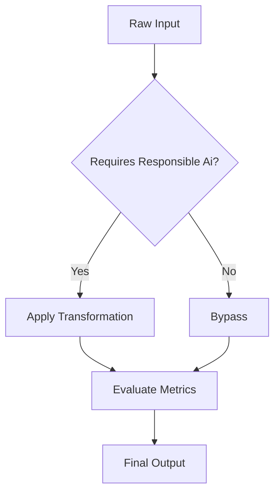

# Explanation: Responsible Ai

## Conceptual Overview
Understanding responsible ai is critical for bridging the gap between technical execution and business impact. 

### Analogy
Think of this process like organizing a messy filing cabinet. Before you can find insights (extract documents), you need a system (the algorithm or transformation).

## Formal Definition

The underlying concept can be expressed mathematically. For instance, consider the fundamental equation of evaluation:

\[
J(\theta) = \frac{1}{2m} \sum_{i=1}^{m} (h_\theta(x^{(i)}) - y^{(i)})^2
\]

## Workflow Diagram

## Connection to Practice
In your assessment, you must justify *why* you chose a particular approach. Use the principles outlined here to build your argument for the presentation.
