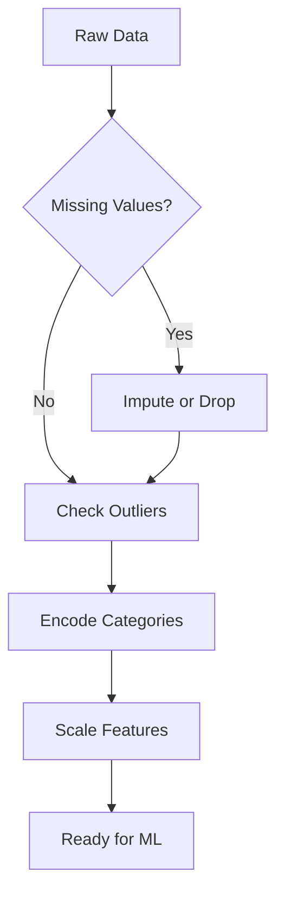

# AI Agent Prompt: Complete the BPP M9 Machine Learning MkDocs Microsite

## YOUR MISSION

You are working on a **MkDocs Material** microsite for the **M9 Machine Learning** module at **BPP University School of Technology**. The site structure, config, GitHub Actions workflow, and one fully-written exemplar tutorial already exist. Your job is to:

1. **Push the existing project to GitHub** (initial setup)
2. **BPP-ify the theme** (custom colours, logo, fonts to match BPP's brand)
3. **Write all 110 placeholder pages** with rich, high-quality educational content
4. **Add relevant images** to every page (diagrams, charts, visualisations from open-licensed sources)
5. **Push the completed site to GitHub** so it auto-deploys

---

## PROJECT LOCATION

The microsite files are in a folder called `ml-microsite` (or wherever the user extracted the zip). The folder structure is:

```
ml-microsite/
├── mkdocs.yml                          # Site configuration
├── requirements.txt                    # mkdocs-material
├── README.md
├── .gitignore
├── .github/workflows/ci.yml           # Auto-deploy to GitHub Pages
└── docs/
    ├── index.md                        # Homepage (written)
    ├── javascripts/mathjax.js          # LaTeX support
    ├── getting-started/                # 3 pages (written)
    │   ├── index.md
    │   ├── setup.md
    │   ├── ml-workflow.md
    │   └── assessment-overview.md
    ├── topic-1-data-preparation/       # 1 exemplar + 15 placeholders
    │   ├── index.md
    │   ├── tutorials/
    │   │   ├── loading-exploring.md    # ★ FULLY WRITTEN EXEMPLAR ★
    │   │   ├── missing-values.md       # placeholder
    │   │   └── ...
    │   ├── how-to/
    │   ├── reference/
    │   └── explanation/
    ├── topic-2-feature-engineering/     # 14 placeholders
    ├── topic-3-predictive-modelling/    # 16 placeholders
    ├── topic-4-nonparametric-modelling/ # 11 placeholders
    ├── topic-5-clustering/             # 11 placeholders
    ├── topic-6-time-series/            # 13 placeholders
    ├── topic-7-validation-tuning/      # 15 placeholders
    ├── topic-8-communication-impact/   # 15 placeholders
    └── appendix/                       # 5 pages (1 written, 4 placeholders)
```

## GITHUB REPOSITORY

- **Repo:** `https://github.com/bpp-sot/l6ds-m9-machine-learning.git`
- **Organisation:** `bpp-sot` (BPP School of Technology)
- **Branch:** `main`
- **Deployment:** GitHub Actions → GitHub Pages (workflow already in `.github/workflows/ci.yml`)
- **Live URL (once deployed):** `https://bpp-sot.github.io/l6ds-m9-machine-learning/`
- **GitHub Pages source:** Set to "GitHub Actions" in repo Settings → Pages

### Initial Push (do this first)

```bash
cd ml-microsite
git init
git add .
git commit -m "Initial microsite structure with exemplar tutorial"
git branch -M main
git remote add origin https://github.com/bpp-sot/l6ds-m9-machine-learning.git
git push -u origin main
```

After pushing, go to **Settings → Pages → Source** and confirm it says **GitHub Actions**. The workflow will run automatically and deploy the site.

---

## TASK 1: BPP BRAND CUSTOMISATION

### BPP Brand Colours (extract from the screenshot reference)

BPP uses a dark, professional palette. Looking at their LMS:

| Element | Colour | Usage |
|---------|--------|-------|
| Primary | `#1a1a2e` (very dark navy/charcoal) | Navigation bar, headers |
| Accent | `#c8a951` or `#b8960c` (gold) | Links, highlights, buttons |
| Background | `#f5f5f5` (light grey) | Page background |
| Text | `#333333` | Body text |
| Card BG | `#ffffff` | Content cards |

### What to Change in `mkdocs.yml`

Replace the current teal theme with BPP colours. Update the `theme` section:

```yaml
theme:
  name: material
  custom_dir: docs/overrides     # For custom logo and CSS
  palette:
    - scheme: default
      primary: custom             # We'll define custom colours in CSS
      accent: custom
      toggle:
        icon: material/brightness-7
        name: Switch to dark mode
    - scheme: slate
      primary: custom
      accent: custom
      toggle:
        icon: material/brightness-4
        name: Switch to light mode
  font:
    text: Inter                   # Clean modern font similar to BPP's
    code: JetBrains Mono
  logo: assets/bpp-logo.png       # BPP logo file
  favicon: assets/bpp-favicon.png
  features:
    - navigation.tabs
    - navigation.sections
    - navigation.expand
    - navigation.top
    - navigation.indexes
    - search.suggest
    - search.highlight
    - content.tabs.link
    - content.code.copy
    - content.code.annotate
    - toc.follow
  icon:
    repo: fontawesome/brands/github
```

### Create Custom CSS

Create `docs/stylesheets/extra.css`:

```css
/* BPP Brand Override */
:root {
  --md-primary-fg-color: #1a1a2e;
  --md-primary-fg-color--light: #2d2d4e;
  --md-primary-fg-color--dark: #0d0d17;
  --md-accent-fg-color: #c8a951;
  --md-accent-fg-color--transparent: #c8a95133;
}

[data-md-color-scheme="slate"] {
  --md-primary-fg-color: #1a1a2e;
  --md-accent-fg-color: #c8a951;
}

/* BPP gold links */
.md-nav__link:hover,
.md-nav__link--active {
  color: #c8a951 !important;
}

/* Gold accents on admonitions */
.md-typeset .admonition.tip,
.md-typeset details.tip {
  border-color: #c8a951;
}

/* Header bar styling */
.md-header {
  background-color: #1a1a2e;
}

/* Footer */
.md-footer {
  background-color: #1a1a2e;
}

/* Tab active indicator */
.md-tabs__link--active {
  border-bottom-color: #c8a951 !important;
}
```

Add to `mkdocs.yml`:

```yaml
extra_css:
  - stylesheets/extra.css
```

### BPP Logo

Place the BPP logo (the shield icon with "BPP" text — white version for dark header) at:
- `docs/assets/bpp-logo.png` (white logo, ~200px wide, transparent background)
- `docs/assets/bpp-favicon.png` (small square version, 32x32 or 64x64)

If you don't have the logo file, create a simple SVG placeholder:

```svg
<svg xmlns="http://www.w3.org/2000/svg" viewBox="0 0 100 40">
  <text x="50" y="30" font-family="Arial" font-weight="bold" font-size="28"
        fill="white" text-anchor="middle">BPP</text>
</svg>
```

Save as `docs/assets/bpp-logo.svg` and reference in mkdocs.yml as `logo: assets/bpp-logo.svg`.

### Create Theme Overrides Directory

```bash
mkdir -p docs/overrides/partials
```

Create `docs/overrides/partials/copyright.html`:

```html
<div class="md-copyright">
  &copy; 2026 BPP University School of Technology — BSc (Hons) Data Science
</div>
```

---

## TASK 2: WRITE ALL PLACEHOLDER PAGES

### Critical: Read the Exemplar First

Before writing ANY page, read `docs/topic-1-data-preparation/tutorials/loading-exploring.md` in full. This is the **style template** for the entire site. Every page you write must follow its patterns.

### Identifying Placeholders

Every placeholder page contains this text:

```markdown
!!! info "Under Development"
    This tutorial is currently being written. Check back soon.
```

Find all of them: `grep -rl "Under Development" docs/`

### Content Quality Standards

Every page you write must meet ALL of these criteria:

#### For Tutorials (learning-oriented, step-by-step)
- **Opening quote** — a relevant, attributed quotation
- **"What You Will Learn"** section — 4–6 bullet points
- **Prerequisites** — link back to setup guide and any prior tutorials
- **Numbered steps** — each step has an explanation, then a complete runnable code block
- **All code must be runnable** in Jupyter Notebook or Google Colab using scikit-learn, pandas, numpy, matplotlib, seaborn
- **Admonition boxes** throughout:
  - `!!! tip "Workplace Tip"` — connects the concept to real workplace scenarios
  - `!!! note "Assessment Connection"` — links to specific assessment rubric criteria
  - `!!! warning` — common mistakes to avoid
  - `!!! success` — what good work looks like
- **Summary** section at the end
- **"Next Steps"** — link to the next logical page
- **KSB Mapping Table** — maps to specific Knowledge, Skills, and Behaviours from the L6 Data Science Apprenticeship Standard

Example KSB table:
```markdown
## KSB Mapping

| KSB | Description | How This Tutorial Addresses It |
|-----|-------------|-------------------------------|
| K3 | Data management and storage | Loading data from multiple sources |
| S4 | Import, cleanse, transform data | Systematic data quality assessment |
| B2 | Logical and analytical approach | Structured, documented exploration |
```

#### For How-to Guides (task-oriented, problem → solution)
- **Problem** — what specific workplace problem this solves
- **Solution** — step-by-step with code
- **Discussion** — when to use this approach, alternatives, caveats
- Keep it concise and task-focused — no lengthy theory

#### For Reference (information-oriented, lookup)
- **Tables** — parameter names, types, defaults, descriptions
- **Code snippets** — minimal, showing exact syntax
- **Comparison tables** — when comparing algorithms or approaches
- No narrative — this is for quick lookup

#### For Explanation (understanding-oriented, conceptual)
- **Analogies** — make abstract concepts concrete
- **Mermaid diagrams** — use ```` ```mermaid ```` blocks for flow charts and concept maps
- **LaTeX equations** — use `\( \)` for inline and `\[ \]` for display math
- **Historical context** — why techniques were developed
- **Connect to practice** — how understanding this concept improves real work

### Specific Content for Each Topic

#### Topic 1: Data Preparation & Preprocessing
Focus on pandas, sklearn.preprocessing, missingno. Cover:
- Missing values: msno, SimpleImputer, KNNImputer, IterativeImputer
- Encoding: OneHotEncoder, OrdinalEncoder, TargetEncoder, pd.get_dummies
- Scaling: StandardScaler, MinMaxScaler, RobustScaler, MaxAbsScaler
- Outliers: IQR method, Z-score, Isolation Forest, treatment strategies
- Pipelines: Pipeline, ColumnTransformer, make_pipeline, FunctionTransformer

#### Topic 2: Feature Engineering & Selection
Focus on creating informative features and selecting the best ones:
- Feature creation: aggregations, ratios, binning, polynomial features
- DateTime features: day of week, month, hour, time since event
- Text features: TF-IDF, word counts, sentiment (basic)
- Filter methods: correlation, mutual_info_classif, VarianceThreshold
- Wrapper methods: RFE, RFECV, SequentialFeatureSelector
- Embedded methods: Lasso (L1), tree feature_importances_, ElasticNet
- PCA: explained_variance_ratio_, scree plots, n_components selection

#### Topic 3: Predictive Modelling (Supervised Learning)
Focus on core algorithms with sklearn:
- LinearRegression, Ridge, Lasso, ElasticNet
- LogisticRegression (binary and multi-class)
- DecisionTreeClassifier/Regressor with tree visualisation
- RandomForestClassifier/Regressor, feature importances
- GradientBoostingClassifier/Regressor
- Model comparison using cross_val_score

#### Topic 4: Non-Parametric Modelling
- KNeighborsClassifier/Regressor with distance metrics
- SVC/SVR with linear, rbf, poly kernels, kernel trick explanation
- Advanced tree methods: ExtraTreesClassifier, BaggingClassifier
- XGBClassifier/Regressor, LGBMClassifier/Regressor (install via pip)

#### Topic 5: Clustering & Unsupervised Learning
- KMeans: inertia, elbow method, silhouette analysis
- AgglomerativeClustering: dendrograms with scipy
- DBSCAN: eps and min_samples tuning, noise handling
- Cluster evaluation: silhouette_score, calinski_harabasz_score, davies_bouldin_score

#### Topic 6: Time Series Analysis & Forecasting
- Use statsmodels for ARIMA/SARIMA: ARIMA, SARIMAX, seasonal_decompose
- Use prophet for automated forecasting
- Stationarity: ADF test (adfuller), differencing, KPSS
- ACF/PACF plots for order selection
- Walk-forward validation (TimeSeriesSplit)

#### Topic 7: Model Validation & Hyperparameter Tuning
- train_test_split, StratifiedKFold, TimeSeriesSplit
- GridSearchCV, RandomizedSearchCV with scoring parameter
- Optuna for Bayesian optimisation: create_study, suggest_float, suggest_int
- Learning curves: learning_curve function, diagnosing overfitting/underfitting
- Statistical comparison: paired t-test, Wilcoxon signed-rank test

#### Topic 8: Application, Communication & Impact
- SHAP: TreeExplainer, summary_plot, force_plot, dependence_plot
- LIME: LimeTabularExplainer, explain_instance
- Feature importance visualisation with matplotlib/seaborn
- ROI analysis: quantifying model value vs baseline, cost-benefit matrices
- Model cards: documenting model purpose, limitations, fairness considerations

### Code Style Requirements

```python
# Always include these imports at the top of tutorials
import pandas as pd
import numpy as np
import matplotlib.pyplot as plt
import seaborn as sns
from sklearn.model_selection import train_test_split

# Always set consistent plot styles
sns.set_style('whitegrid')
plt.rcParams['figure.figsize'] = (10, 6)
```

- Use `sklearn` naming conventions (X_train, X_test, y_train, y_test)
- Always set `random_state=42` for reproducibility
- Print model results with clear labels
- Include inline comments explaining what each step does
- Use `make_classification`, `make_regression`, `make_blobs`, or `load_iris`/`load_diabetes` for demo datasets rather than external files

---

## TASK 3: ADD IMAGES TO EVERY PAGE

### Image Strategy

Every tutorial and explanation page should have **2–4 images**. How-to guides need **1–2**. Reference pages can use tables instead of images.

### Where to Get Images

Use ONLY images from these open-licensed sources:

1. **Generate your own** with matplotlib/seaborn code blocks that readers can run themselves — this is the BEST approach because students can reproduce them
2. **Scikit-learn documentation** — all images from sklearn docs are BSD licensed. Reference them as: ``
3. **Wikimedia Commons** — search for CC-BY or CC-BY-SA licensed diagrams
4. **Draw Mermaid diagrams** in the Markdown itself (built into MkDocs Material)

### Image Approach: Self-Generated > External

**Preferred:** Include the matplotlib/seaborn code that generates the visualisation inline. Students learn by running the code AND get the visual. Example:

```python
from sklearn.tree import DecisionTreeClassifier, plot_tree

clf = DecisionTreeClassifier(max_depth=3, random_state=42)
clf.fit(X_train, y_train)

plt.figure(figsize=(20, 10))
plot_tree(clf, feature_names=feature_names, class_names=class_names,
          filled=True, rounded=True, fontsize=10)
plt.title('Decision Tree Visualisation')
plt.tight_layout()
plt.show()
```

**Also acceptable:** Save generated plots to `docs/assets/images/` and reference them:

```markdown

```

### For images you save locally:

Create the directory structure:
```bash
mkdir -p docs/assets/images/topic-1
mkdir -p docs/assets/images/topic-2
# ... etc
```

### Mermaid Diagrams

Use these throughout for conceptual content:

````markdown

````

### LaTeX Equations

Use throughout for mathematical content:

```markdown
The Mean Squared Error is defined as:

\[
MSE = \frac{1}{n} \sum_{i=1}^{n} (y_i - \hat{y}_i)^2
\]

Where \( y_i \) is the actual value and \( \hat{y}_i \) is the predicted value.
```

---

## TASK 4: FINAL VERIFICATION AND PUSH

### Before Pushing, Verify Everything

```bash
# Install mkdocs-material locally
pip install mkdocs-material

# Build with strict mode — should produce ZERO warnings
cd ml-microsite
mkdocs build --strict

# Preview locally
mkdocs serve
# Open http://127.0.0.1:8000 and click through every page
```

### Verification Checklist

- [ ] `mkdocs build --strict` produces zero errors/warnings
- [ ] Every page loads without 404s
- [ ] Navigation tabs work correctly (all 8 topics + Getting Started + Appendix)
- [ ] Dark mode toggle works
- [ ] BPP logo appears in the top-left header
- [ ] Code blocks have copy buttons
- [ ] Mermaid diagrams render
- [ ] LaTeX equations render
- [ ] All internal links work
- [ ] No pages still contain "Under Development" text
- [ ] Search works (type a term, get results)

### Push the Completed Site

```bash
git add .
git commit -m "Complete microsite: all 130 pages with BPP branding"
git push origin main
```

The GitHub Actions workflow will automatically build and deploy to:
**https://bpp-sot.github.io/l6ds-m9-machine-learning/**

---

## CONTEXT: WHAT THIS SITE IS FOR

### The Module
**M9 Machine Learning** is a module on the **BSc (Hons) Data Science Integrated Degree Apprenticeship** (Level 6) at BPP University. Students are working professionals who apply ML techniques to real workplace data.

### The Assessment
Students deliver a **20-minute oral presentation** (75%) with a **12-slide deck** (25%) where they:
- Apply ML to a real workplace dataset
- Compare at least 2 ML approaches
- Justify all preprocessing, feature engineering, and model selection decisions
- Evaluate models with appropriate metrics and validation
- Communicate business impact to non-technical stakeholders

### The Audience
- **Data Science apprentices** (Level 6 / final year of BSc)
- They work full-time and study part-time
- They have basic Python and pandas skills
- They need practical, workplace-relevant examples
- They need to connect every technique to their assessment

### The Diátaxis Framework
The site uses the [Diátaxis](https://diataxis.fr/) documentation framework:
- **Tutorials** = learning-oriented (follow along, step-by-step)
- **How-to Guides** = task-oriented (solve a specific problem)
- **Reference** = information-oriented (lookup tables, API docs)
- **Explanation** = understanding-oriented (why things work)

### L6 Data Science Apprenticeship Standard KSBs
Map content to these where relevant:
- **K1**: Statistical concepts for data science
- **K2**: Machine learning algorithms and techniques
- **K3**: Data management and storage approaches
- **K6**: Data analytics and visualisation
- **K7**: Data ethics, privacy and regulatory frameworks
- **S1**: Apply statistical methods to data
- **S2**: Apply machine learning techniques
- **S4**: Import, cleanse, transform and validate data
- **S7**: Analyse data to generate insights
- **S9**: Present findings to stakeholders
- **B1**: Communicate with technical and non-technical stakeholders
- **B2**: Logical and analytical approach to problem solving

---

## PRIORITY ORDER

Work through in this order:

1. **Push initial code to GitHub** and verify the site deploys
2. **BPP branding** (theme, logo, CSS) — commit and push
3. **Topic 1** (Data Preparation) — 15 pages — commit and push
4. **Topic 2** (Feature Engineering) — 14 pages — commit and push
5. **Topic 3** (Predictive Modelling) — 16 pages — commit and push
6. **Topic 4** (Non-Parametric) — 11 pages — commit and push
7. **Topic 5** (Clustering) — 11 pages — commit and push
8. **Topic 6** (Time Series) — 13 pages — commit and push
9. **Topic 7** (Validation & Tuning) — 15 pages — commit and push
10. **Topic 8** (Communication & Impact) — 15 pages — commit and push
11. **Appendix** — 4 remaining pages — commit and push
12. **Final review** — build --strict, fix any warnings, push

Commit and push after completing each topic so the live site updates incrementally.

---

## IMPORTANT NOTES

- **Do NOT use copyrighted images** from textbooks, Medium paywalled articles, or proprietary sources. Generate your own visualisations or use open-licensed sources.
- **Do NOT plagiarise text** from textbooks or online courses. Write original content in an accessible, professional educational tone.
- **Every code block must actually work** — test or mentally verify each snippet uses valid sklearn/pandas/numpy API calls.
- **British English spelling** throughout (e.g., "normalisation" not "normalization", "colour" not "color", "modelling" not "modeling").
- **The site must build clean** — `mkdocs build --strict` with zero warnings before every push.
- **Commit often** — don't try to write all 110 pages in one commit. Push after each topic.
